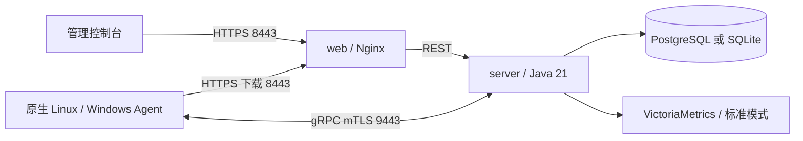

# ALinkSec

[English](README.md) | [简体中文](README-cn.md)

主机安全管控平台，首次开发阶段发布版本 **v0.0.1**。服务端和 Web 使用容器部署，Linux / Windows Agent 以原生单二进制安装到受控主机，通过可连通管理端的网络通信。

[完整部署文档](docs/06-部署文档.md) · [发布版本](https://github.com/wybroot/alinksec/releases/tag/v0.0.1) · [Docker Hub](https://hub.docker.com/r/wangyanbiao/alinksec) · [发布流程](docs/13-版本发布流程.md) · [变更记录](CHANGELOG.md)

## 功能

| 能力 | 已实现内容 |
| --- | --- |
| 主机与资产 | mTLS 注册、心跳，软件/端口/进程/账户/磁盘，Linux 容器及本机 Kubernetes 工作负载只读清点 |
| 基线与扫描 | 结构化基线核查、白名单命令检查、配置修复与复核、漏洞/弱口令/高危端口扫描 |
| 软件包修复 | 按主机 finding 下发，管理员审批、维护窗口、离线补丁与结果回写 |
| 病毒查杀 | SHA256 与规则检测、扫描任务、隔离/恢复、白名单、特征库热更新 |
| 实时防护 | 进程行为、勒索诱饵与加密速率、主机隔离/恢复；Linux 文件完整性和 SSH 登录检测 |
| 管理与运维 | 指令 ACK、断网落盘及重启后补传、原生服务自动恢复、Agent 更新及授权卸载 |
| 控制台 | 主机分页与任务管理、告警/Webhook、三角色 RBAC、审计、报表、安全大屏 |

文件与登录内置防护默认仅告警；主动恢复、封禁及其他响应按实际环境配置。容器清点用于宿主机安全研判，不提供容器编排或生命周期管理。

## 部署模式

| 模式 | 长期服务 | 范围 |
| --- | --- | --- |
| PostgreSQL | PostgreSQL 17、VictoriaMetrics、server、web | 标准部署，最小权限应用账号、90 天指标 |
| SQLite | server、web | 1～10 台、单 server、本机持久化卷，默认关闭指标，无高可用保证 |

Agent 均原生安装，目标主机不需要 Docker、JRE、Node.js 或 Go。v0.0.1 提供 Linux amd64 容器，以及 Linux amd64 / Windows amd64 Agent。



## 快速部署

下载 [v0.0.1 Release](https://github.com/wybroot/alinksec/releases/tag/v0.0.1) 的全部五个附件，在下载目录校验并解压：

```bash
sha256sum --check SHA256SUMS
tar -xzf alinksec-v0.0.1.tar.gz
cd alinksec-v0.0.1/deploy/docker
```

镜像由发布 CI 构建，无需在部署主机现场编译：

```text
wangyanbiao/alinksec:server-v0.0.1
wangyanbiao/alinksec:web-v0.0.1
wangyanbiao/alinksec:sqlite-maintenance-v0.0.1
```

轻量模式先配置 `.env.lite`：`HOST_IP` 为 Agent 实际接入地址，`ALINKSEC_BIND_ADDRESS` 为管理端具体本机 IPv4；设置随机管理员初始密码（至少 12 位）、`ENROLL-` 前缀注册码和 JWT 密钥。示例地址必须替换。

```bash
cp .env.lite.example .env.lite
chmod 600 .env.lite
# 编辑 .env.lite 并填写实际地址和凭据
docker compose --env-file .env.lite -f docker-compose.lite.yml config -q
docker compose --env-file .env.lite -f docker-compose.lite.yml pull server
docker compose --env-file .env.lite -f docker-compose.lite.yml pull web
docker compose --env-file .env.lite -f docker-compose.lite.yml --profile maintenance pull sqlite-maintenance
docker compose --env-file .env.lite -f docker-compose.lite.yml up -d --no-build --no-deps server
# 确认服务端初始化成功并观察内存，再启动 web
docker compose --env-file .env.lite -f docker-compose.lite.yml up -d --no-build --no-deps web
docker compose --env-file .env.lite -f docker-compose.lite.yml cp server:/app/data/certs/ca.crt ./alinksec-ca.crt
```

将平台 CA 导入浏览器信任库后访问 `https://<HOST_IP>:8443/`，使用 `admin` 和配置的初始密码登录。大屏入口为 `/screen`。标准模式采用 `.env.example` 与 `docker-compose.yml`，另配两个不同的 PostgreSQL 密码，按 [部署文档第 5、6 节](docs/06-部署文档.md)依次启动所需服务。

把对应 Agent 成品与 `alinksec-ca.crt` 传到目标主机。Linux 示例：

```bash
chmod 755 alinksec-agent-linux-amd64
sudo ./alinksec-agent-linux-amd64 install --server <服务器地址>:9443 --token <ENROLL-注册码> --ca-file ./alinksec-ca.crt
./alinksec-agent-linux-amd64 version
```

注册后按部署文档第 8 节安装 systemd / Windows SCM 服务。Linux 服务单元位于 `deploy/agent/alinksec-agent.service`。

## 验证与边界

开发封版清单 28 项中 26 项 CLOSED、1 项 ACCEPTED、1 项 N/A，无 OPEN/VERIFY。Linux 实际功能、双数据库全新部署、浏览器及本机原生成品已经验收；Windows 实际 SCM 验证覆盖 mTLS、资产、采集 ACK、启停和自动恢复，尚不代表 Windows 全量安全引擎与 Java 平台完整联动。

原生 Linux Agent 短时实测空闲 CPU 约单核 0.80%、RSS 约 20 MiB，包含采集子进程的 RSS 峰值 47.48 MiB。长期扫描负载、规模目标 100～2000 台、各 Linux 发行版和全部 Windows 版本没有规模或全平台验收承诺。详细证据见 [全功能联动](docs/10-本机全功能联动验收记录.md)及 [原生 Agent 验收](docs/12-原生Agent本机验收记录.md)。

本机测试和构建串行执行，观察 RAM、swap 与内存压力；重构建使用资源监控，低内存机器按需暂停后端，避免一次启动完整 Compose。完整命令见 [验证说明](deploy/tests/README.md)。发布 CI 必须核对同一提交的三个完整 CI 作业，复用已验证 Agent，并在发布前冒烟测试实际容器。

## 开发

Java 21、Go 1.24+、Node.js 22.22+。版本源文件为 `VERSION`，CI 校验各模块版本和 Compose 标签一致。server 为五个 Maven 模块，web 为 Vue 3 / Element Plus / ECharts，agent 为 Go。

```bash
node deploy/release/check-version.mjs
node --test deploy/tests/release-gate.test.mjs
# 以下构建、测试按顺序执行，并遵守 AGENTS.md 的本机资源约束
cd server && mvn -B package
cd ../agent && go test ./...
cd ../web && npm ci && npm test && npm run build
```

## 文档

| 文档 | 内容 |
| --- | --- |
| [01 总体架构](docs/01-总体架构与技术选型.md) | 当前实现与架构规划 |
| [02 通信协议](docs/02-通信协议设计.md) | gRPC、指令与报告、mTLS |
| [03 数据库](docs/03-数据库设计.md) | 双数据库、时序与 schema |
| [04 Agent 设计](docs/04-Agent设计与策略规范.md) | 模块、策略、资源目标 |
| [05 扩展能力](docs/05-扩展能力设计.md) | 病毒、诱饵、修复、容器清点 |
| [06 部署文档](docs/06-部署文档.md) | 发布产物、安装、维护和排障 |
| [07 缺陷清单](docs/07-封版缺陷清单.md) | 当前状态和历史修复证据 |
| [08 双数据库实施](docs/08-双数据库轻量化部署改造计划.md) | 模式边界和实施记录 |
| [09 节点验收](docs/09-剩余节点验收记录.md) | 串行验证历史与最新结论 |
| [10 全功能联动](docs/10-本机全功能联动验收记录.md) | Linux 实际 Agent 业务链路 |
| [11 登录与文件防护](docs/11-登录与文件防护.md) | Linux SSH、完整性与主动响应 |
| [12 原生 Agent](docs/12-原生Agent本机验收记录.md) | Linux 资源采样和 Windows SCM 实测 |
| [13 发布流程](docs/13-版本发布流程.md) | CI 门禁、镜像、附件和凭据 |
| [部署检查清单](deploy/部署检查清单.md) | 逐项安装验收 |

后续方向：扩大平台与长期负载验收、完善交付能力；多租户尚未实现。
