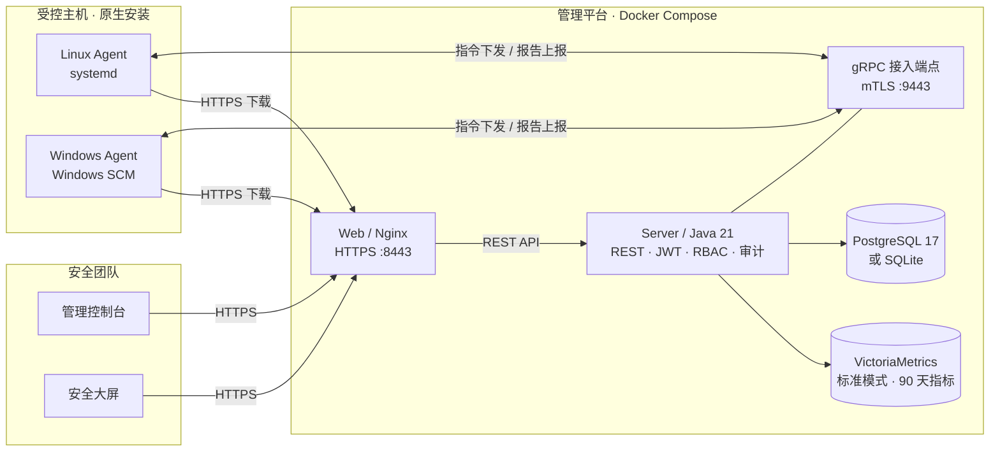
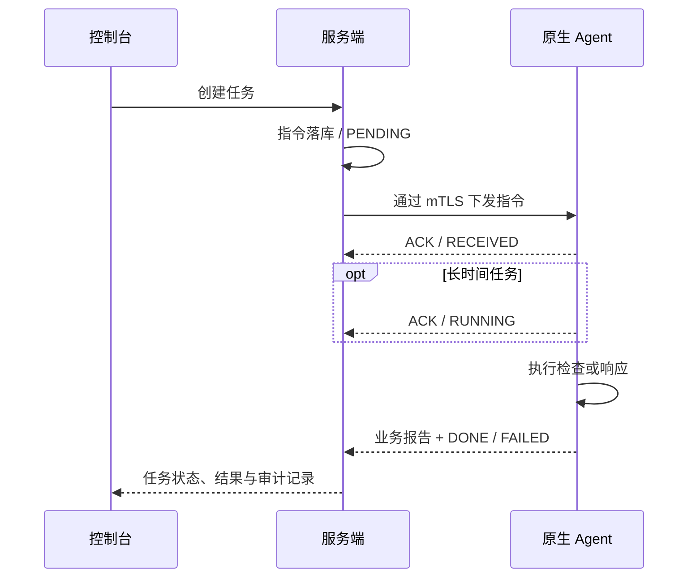
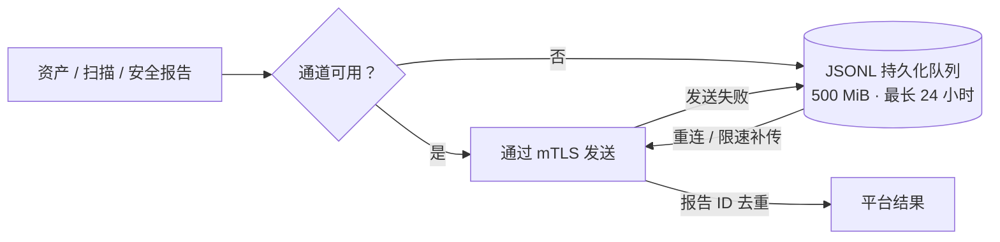

<div align="center">

# 🛡️ ALinkSec

### 一体化主机安全管控平台

**看清资产，发现风险，让每一次安全处置都有据可循。**

资产清点 · 基线核查 · 漏洞修复 · 病毒查杀<br/>勒索检测 · 主机隔离 · 操作审计 · 安全大屏

[English](README.md) · [简体中文](README-cn.md)

[](https://github.com/wybroot/alinksec/releases/tag/v0.0.1) [](https://github.com/wybroot/alinksec/actions/workflows/ci.yml) [](https://github.com/wybroot/alinksec/actions/workflows/release.yml) [](https://hub.docker.com/r/wangyanbiao/alinksec) [](LICENSE)

   

[项目概览](#overview) · [系统架构](#architecture) · [核心能力](#capabilities) · [快速部署](#quick-start) · [验证范围](#validation) · [开发指南](#development) · [文档中心](#documentation)

</div>

---

<a id="overview"></a>

## ✨ 从资产可见到安全处置

ALinkSec 将主机资产、安全检查、威胁检测和响应处置汇集到一个管理平台。原生 Go Agent 在目标主机采集证据，服务端通过 gRPC mTLS 协调策略与任务，Web 控制台统一呈现资产、风险、告警和执行结果。

从发现问题到修复问题，围绕同一台主机完成闭环：查看受影响资产、发起检查、分析结果、审批处置，再通过审计记录追溯操作。专用安全大屏 `/screen` 提供环境概况，方便安全团队持续观察整体态势。

### 一眼了解 ALinkSec

| 💻 原生 Agent | 📡 指令全程可观测 | 🛂 分级权限 |
| :---: | :---: | :---: |
| **Linux & Windows**<br/>单二进制 · systemd / Windows SCM | **11 种指令**<br/>接收、执行与终态 ACK | **3 类角色**<br/>管理员 · 操作员 · 只读用户 |
| **2 种部署模式**<br/>PostgreSQL / 轻量 SQLite | **500 MiB 断网队列**<br/>报告落盘 · 最长保留 24 小时 | **15 分钟卸载口令**<br/>平台授权 · 限时有效 · 一次性消费 |

> **轻量化设计，已有实测**：原生 Linux Agent 短时采样的空闲 RSS 约 **20 MiB**，空闲 CPU 约为单核的 **0.80%**。这是采样结果，具体负载随主机和任务变化，详见[验证范围](#validation)。

### 功能全景

| 安全领域 | 已实现能力 |
| --- | --- |
| 🖥️ **主机与资产** | mTLS 注册、心跳与在线状态；软件、进程、端口、账户、磁盘清点；Linux 容器及本机 Kubernetes 工作负载只读清点。 |
| 📋 **安全基线** | 结构化检查、检查定义热下发、不合规项分析，以及带复核的配置修复。 |
| 🔎 **风险发现** | 漏洞、弱口令、高危端口扫描；结合主机资产查看风险与受影响对象。 |
| 🧩 **软件包修复** | 按主机 finding 审批修复、维护窗口控制、离线补丁分发与执行结果回写。 |
| 🦠 **病毒查杀** | SHA256 与规则检测；快速、全盘、自定义扫描；隔离、恢复、删除、白名单及特征库更新。 |
| 🛡️ **主机防护** | 可疑进程行为、勒索诱饵、加密速率检测；主机隔离与恢复；Linux 文件完整性及 SSH 登录防护。 |
| ⚙️ **Agent 运维** | 指令 ACK、断网报告落盘补传、原生服务恢复、Agent 更新与授权卸载。 |
| 📊 **安全运营** | 主机列表、任务管理、告警、Webhook、报表和安全大屏；三角色 RBAC 与操作审计。 |

文件与登录内置防护默认仅告警；自动恢复、封禁及其他主动响应按实际环境明确启用。容器清点用于宿主机安全研判，不提供容器编排或生命周期管理。

---

<a id="architecture"></a>

## 🏗️ 系统架构

**管理端容器部署 · 受控端原生安装 · 通信链路加密认证**



Agent 为原生单二进制，目标主机不需要 Docker、JRE、Node.js 或 Go 工具链。**v0.0.1** 提供 Linux amd64 容器，以及 Linux amd64 / Windows amd64 Agent 成品。

当前开发分支新增 **Linux ARM64（aarch64）** Agent、amd64/arm64 双架构容器构建与原生 CI。ARM64 尚未包含在已发布的 v0.0.1 中；新版本发布前请按 [ARM64 部署说明](docs/14-ARM64支持.md)从当前源码构建。

<details>
<summary><b>📦 项目目录结构</b></summary>

```text
alinksec/
├── agent/                       原生 Go Agent
│   ├── cmd/agent/               run · install · uninstall · version
│   └── internal/
│       ├── comm/                gRPC · ACK · 断网队列 · 状态持久化
│       ├── collector/           主机、容器及工作负载资产
│       ├── baseline/            结构化检查与白名单命令
│       ├── scan/                漏洞、口令及端口检查
│       ├── virusscan/           特征库 · 规则 · 隔离区 · 白名单
│       ├── fixer/               配置与软件包修复
│       ├── guard/               诱饵 · 文件/登录防护 · 主机隔离
│       └── upgrade/             下载校验与二进制替换
├── server/                      Java / Spring Boot · 五个 Maven 模块
│   ├── alinksec-bootstrap/      应用启动与初始账号
│   ├── alinksec-gateway/        REST API · 认证 · 授权
│   ├── alinksec-service/        任务、报告及各安全域服务
│   ├── alinksec-proto/          生成的协议绑定
│   └── alinksec-common/         共享接口类型与工具
├── web/                         Vue 3 控制台与安全大屏
├── proto/agent.proto            指令、报告与 ACK 协议
├── deploy/                      Compose · 原生服务 · 发布工具
├── docs/                        设计、部署与验收证据
└── VERSION                      产品统一版本号
```

</details>

---

<a id="capabilities"></a>

## 🔬 核心能力详解

### 📡 指令闭环：从下发到执行，每一步都看得见

每条指令拥有唯一 ID 和持久化状态。接收 ACK 区分“已送达”与“已执行”，长任务回报执行阶段，终态 ACK 携带结果或失败原因。主机重新连接后可补发待处理指令，指令去重机制减少重复执行。



<details>
<summary><b>查看全部 11 种指令</b></summary>

| 指令 | 用途 |
| --- | --- |
| `baseline_check` | 安全基线核查 |
| `vuln_scan` | 漏洞、口令与端口检查 |
| `vuln_fix` | 配置或软件包修复 |
| `virus_scan` | 快速、全盘、自定义病毒扫描 |
| `virus_action` | 检出文件隔离、恢复或删除 |
| `signature_update` | 检测特征库更新 |
| `policy_sync` | 主机防护策略同步 |
| `protect_action` | 封禁、解封、进程查杀、主机隔离或恢复 |
| `agent_upgrade` | 下载、校验并替换 Agent 成品 |
| `collect_now` | 立即触发指定采集器 |
| `agent_control` | 重启、暂停/恢复采集或布防卸载口令 |

</details>

### 💾 断网补传：报告落盘，重启后继续发送

断线期间产生的业务报告写入 JSONL 持久化队列，Agent 重启后可以重新加载，连接恢复后限速补传。服务端通过报告 ID 去重，减少补传带来的重复数据。



队列有容量和保留时长上限：超过 24 小时或容量限制的数据会淘汰。心跳、指标和 ACK 按各自协议机制处理。

### 📋 基线与修复：检查可更新，修复有复核

文件内容、配置行、权限等结构化检查定义随任务下发，无需为了更新检查项重编所有 Agent。命令输出检查使用 Agent 内置白名单。配置修复遵循 **备份 → 执行 → 复核**，执行或复核失败时尝试回滚，并将处理结果回传平台。

软件包修复采用独立的审批与维护窗口流程，按主机 finding 下发，支持离线补丁交付。软件包安装失败会如实上报，不执行自动包回滚。

### 🦠 病毒查杀：多模式检测，可恢复隔离

SHA256 特征与规则匹配支持**快速扫描、全盘扫描和自定义目录扫描**。检出文件可进入保留恢复元信息的隔离区，再由授权操作员恢复或删除。白名单在 Agent 检测前生效；特征库更新同步重载常驻引擎并失效 clean 缓存，无需重启 Agent 即可应用新增检测。

### 🛡️ 主机防护：行为、文件与登录多层联动

勒索诱饵与加密速率监控补充进程行为检测。Linux 文件完整性规则识别受保护文件变更，SSH 规则检测登录爆破及异常时段登录。策略支持信任来源、排除账户、时区和响应动作。

主机隔离与恢复通过带 ACK 的指令管理，配置管理地址放行规则并持久化隔离状态。实际防火墙行为取决于目标平台和网络配置。策略配置与边界详见[登录与文件防护文档](docs/11-登录与文件防护.md)。

### 🔐 平台自身安全：认证、授权与审计协同

| 层面 | 机制 |
| --- | --- |
| **通信** | 注册与 HTTPS 下载使用 TLS；已注册 Agent 通道使用 gRPC mTLS。 |
| **认证** | 控制台/API 使用 JWT，密码 bcrypt 存储，注册码可配置。 |
| **授权** | `admin`、`operator`、`viewer` 三类角色，受保护操作由服务端检查权限。 |
| **审计** | 操作留痕、凭据脱敏、CSV 导出；被拒绝的写操作同样留审计记录。 |
| **Agent 生命周期** | 更新成品 SHA256 校验；卸载须经平台授权，口令 15 分钟过期、一次性消费。 |

---

<a id="quick-start"></a>

## 🚀 快速部署

### 选择部署模式

| | 🪶 轻量模式 | 🗄️ 标准模式 |
| --- | --- | --- |
| **数据库** | 本机持久化卷上的 SQLite | PostgreSQL 17，最小权限应用账号 |
| **长期服务** | `server` + `web` | PostgreSQL + VictoriaMetrics + `server` + `web` |
| **指标** | 默认关闭 | VictoriaMetrics，保留 90 天 |
| **范围** | 初始 1～10 台、单 server，无高可用保证 | 标准数据库部署 |
| **启动文件** | [docker-compose.lite.yml](deploy/docker/docker-compose.lite.yml) | [docker-compose.yml](deploy/docker/docker-compose.yml) |

两种模式使用相同业务接口和原生 Agent 协议。SQLite 数据应放在本机磁盘，不使用 NFS/SMB。下面以轻量模式为例；标准模式按[部署文档第 5、6 节](docs/06-部署文档.md)完成数据库初始化并依次启动服务。

### 1. 下载并校验发布成品

从 **[v0.0.1 Release](https://github.com/wybroot/alinksec/releases/tag/v0.0.1)** 下载全部五个附件：

| 附件 | 内容 |
| --- | --- |
| `alinksec-v0.0.1.tar.gz` | 源码、部署配置与文档 |
| `alinksec-agent-linux-amd64` | Linux 原生 Agent |
| `alinksec-agent-windows-amd64.exe` | Windows 原生 Agent |
| `release-manifest.json` | 源码提交、CI 引用与镜像摘要 |
| `SHA256SUMS` | 其他四个附件的校验和 |

在下载目录校验并解压：

```bash
sha256sum --check SHA256SUMS
tar -xzf alinksec-v0.0.1.tar.gz
cd alinksec-v0.0.1/deploy/docker
```

镜像已由发布 CI 构建，部署主机无需现场编译：

```text
wangyanbiao/alinksec:server-v0.0.1
wangyanbiao/alinksec:web-v0.0.1
wangyanbiao/alinksec:sqlite-maintenance-v0.0.1
```

### 2. 启动管理平台

复制示例配置，然后填写实际地址与凭据：

```bash
cp .env.lite.example .env.lite
chmod 600 .env.lite
```

| 配置项 | 应填写的值 |
| --- | --- |
| `HOST_IP` | Agent 可连通的服务器 IPv4 或 DNS 名称 |
| `ALINKSEC_BIND_ADDRESS` | 管理端具体本机 IPv4 |
| `ALINKSEC_BOOTSTRAP_ADMIN_PASSWORD` | 随机管理员初始密码，至少 12 位 |
| `ALINKSEC_BOOTSTRAP_ENROLL_TOKEN` | `ENROLL-` 前缀的随机注册码 |
| `ALINKSEC_JWT_SECRET` | 随机 JWT 签名密钥 |

校验配置、拉取镜像，再**一个服务一个服务地启动**：

```bash
docker compose --env-file .env.lite -f docker-compose.lite.yml config -q
docker compose --env-file .env.lite -f docker-compose.lite.yml pull server
docker compose --env-file .env.lite -f docker-compose.lite.yml pull web
docker compose --env-file .env.lite -f docker-compose.lite.yml --profile maintenance pull sqlite-maintenance
docker compose --env-file .env.lite -f docker-compose.lite.yml up -d --no-build --no-deps server
# 确认初始化成功并观察可用内存，再启动 web。
docker compose --env-file .env.lite -f docker-compose.lite.yml up -d --no-build --no-deps web
docker compose --env-file .env.lite -f docker-compose.lite.yml cp server:/app/data/certs/ca.crt ./alinksec-ca.crt
```

将 `alinksec-ca.crt` 导入浏览器信任库，使用 `admin` 和配置的初始密码登录，首次登录后修改密码。

| 入口 | 地址 |
| --- | --- |
| 🖥️ 管理控制台 | `https://<HOST_IP>:8443/` |
| 📊 安全大屏 | `https://<HOST_IP>:8443/screen` |

### 3. 接入原生 Agent

将对应系统的 Agent 成品与 `alinksec-ca.crt` 传到目标主机。Linux 主机还需将发布包中的 `deploy/agent/alinksec-agent.service` 复制到当前工作目录，文件名为 `alinksec-agent.service`：

ARM64 主机使用当前源码构建或后续 ARM64 版本提供的 `alinksec-agent-linux-arm64`；现有 v0.0.1 的 Linux 成品为 amd64。

```bash
sudo install -m 0755 alinksec-agent-linux-amd64 /usr/local/bin/alinksec-agent
sudo /usr/local/bin/alinksec-agent install \
  --server <server-address>:9443 \
  --token <ENROLL-token> \
  --ca-file ./alinksec-ca.crt
sudo install -m 0644 alinksec-agent.service /etc/systemd/system/alinksec-agent.service
sudo systemctl daemon-reload
sudo systemctl enable --now alinksec-agent
systemctl status alinksec-agent
/usr/local/bin/alinksec-agent version
```

注册步骤写入配置并领取客户端证书，原生服务随后维持通信通道、心跳与资产采集。Windows SCM 安装、服务恢复、日常维护与排障详见 **[完整部署文档](docs/06-部署文档.md)**。

<details>
<summary><b>🔌 端口与连通要求</b></summary>

| 端口 | 用途 | 访问方 |
| --- | --- | --- |
| `9443` | Agent 注册与 gRPC mTLS | 受控主机 |
| `8443` | HTTPS 控制台、API、成品下载 | 浏览器与受控主机 |
| `8081` | HTTP 重定向到 HTTPS | 浏览器 |
| `5432` / `8428` | PostgreSQL / VictoriaMetrics | 仅 Compose 内网 |

来源限制按交付环境配置。Agent 只需能通过网络访问管理平台，不依赖 Docker 网络。

</details>

---

<a id="validation"></a>

## ✅ 发布验证与适用范围

**v0.0.1 是首次开发阶段发布版本。**开发验收清单共 28 项：**26 项 CLOSED、1 项 ACCEPTED、1 项 N/A**，无 OPEN 或 VERIFY 项。发布版本对应的[完整 CI](https://github.com/wybroot/alinksec/actions/runs/36978905551)和[发布工作流](https://github.com/wybroot/alinksec/actions/runs/36993494771)均已通过。

| 验证领域 | 证据 |
| --- | --- |
| **Linux 业务链路** | 实际 Agent 任务、扫描、修复及防护联动，见[全功能联动验收](docs/10-本机全功能联动验收记录.md)。 |
| **部署与控制台** | 双数据库全新部署、浏览器流程及发布成品容器冒烟。 |
| **Linux 原生服务** | 本机成品安装、mTLS、资产、检查、文件监控与自动服务恢复。 |
| **Windows 原生服务** | 实际 SCM、mTLS、资产、采集 ACK、启停及自动恢复，见[原生 Agent 验收](docs/12-原生Agent本机验收记录.md)。 |

<details>
<summary><b>📈 资源实测与验收边界</b></summary>

Linux 原生采样覆盖约 197 秒，包含启动、空闲、采集、短基线任务、文件监控和重启。

| 指标 | 观测结果 |
| --- | --- |
| 空闲 CPU | 约 **单核 0.80%** |
| 空闲 RSS | 约 **20 MiB** |
| 包含采集子进程的 RSS 峰值 | **47.48 MiB** |

上述测量不覆盖长期扫描或持续高负载。Windows SCM 验证不等于 Windows 全量安全引擎与 Java 平台完整联动验收。100～2000 台的架构目标、各 Linux 发行版及全部 Windows 版本尚未完成规模或全平台验证。多租户尚未实现。详见[验收状态](docs/07-封版缺陷清单.md)与[原生 Agent 测量记录](docs/12-原生Agent本机验收记录.md)。

发布 CI 核对同一源码提交的三个完整 CI 作业，复用已测试的 Agent 二进制，并在发布前冒烟测试实际容器；附件提供校验和与镜像摘要清单。

</details>

---

<a id="development"></a>

## 🧰 开发指南

| 层面 | 技术栈 | 职责 |
| --- | --- | --- |
| **Agent** | Go 1.24+ · gRPC · Protocol Buffers | 原生采集、安全检查与本机响应 |
| **服务端** | Java 21 · Spring Boot 3.3.4 · 五个 Maven 模块 | 主机管理、任务编排与安全 API |
| **控制台** | Vue 3 · Element Plus · ECharts · Vite | 安全运营与大屏展示 |
| **数据** | PostgreSQL 17 / SQLite · VictoriaMetrics | 业务记录与可选时序指标 |
| **交付** | Docker Compose · GitHub Actions · 原生服务 | 版本化镜像、校验成品与部署 |

开发环境使用 **Java 21、Go 1.24+、Node.js 22.22+**。[VERSION](VERSION) 为产品版本源文件，CI 校验 Maven、Agent、npm 和 Compose 版本一致。

<details>
<summary><b>🔧 本机构建与验证命令</b></summary>

测试与构建串行执行，持续观察 RAM、swap 和内存压力。低内存主机在前端打包前暂停后端，并遵守 [AGENTS.md](AGENTS.md) 的资源约束；每次检查仅启动所需服务。完整命令及前置条件见[验证说明](deploy/tests/README.md)。

```bash
node deploy/release/check-version.mjs
node --test deploy/tests/release-gate.test.mjs

# 下列阶段依次执行。
cd server && mvn -B package
cd ../agent && go test ./...
cd ../web && npm ci && npm test && npm run build
```

</details>

反馈问题时请附上版本、平台、复现步骤和脱敏日志，不要包含注册码、私钥或凭据。发布流水线说明见[版本发布流程](docs/13-版本发布流程.md)。

---

<a id="documentation"></a>

## 📚 文档中心

**优先阅读：**[部署文档](docs/06-部署文档.md) · [部署检查清单](deploy/部署检查清单.md) · [变更记录](CHANGELOG.md) · [发布流程](docs/13-版本发布流程.md)

详细设计与部署文档当前为中文，验证命令参考为英文。

<details>
<summary><b>查看全部设计与验收文档</b></summary>

| 文档 | 内容 |
| --- | --- |
| [01 · 总体架构](docs/01-总体架构与技术选型.md) | 当前实现、组件边界与架构规划 |
| [02 · 通信协议](docs/02-通信协议设计.md) | gRPC、指令、报告、ACK 与 mTLS |
| [03 · 数据库](docs/03-数据库设计.md) | PostgreSQL、SQLite、指标与 schema |
| [04 · Agent 设计](docs/04-Agent设计与策略规范.md) | 模块、策略与资源目标 |
| [05 · 扩展能力](docs/05-扩展能力设计.md) | 病毒、诱饵、修复与容器清点 |
| [06 · 部署文档](docs/06-部署文档.md) | 发布产物、原生安装、维护和排障 |
| [07 · 验收状态](docs/07-封版缺陷清单.md) | 当前状态与缺陷修复证据 |
| [08 · 双数据库实施](docs/08-双数据库轻量化部署改造计划.md) | 部署边界与实施历史 |
| [09 · 节点验收](docs/09-剩余节点验收记录.md) | 串行验证与当前结论 |
| [10 · 全功能联动](docs/10-本机全功能联动验收记录.md) | Linux 实际 Agent 业务链路 |
| [11 · 登录与文件防护](docs/11-登录与文件防护.md) | Linux SSH、文件完整性与响应策略 |
| [12 · 原生 Agent 验收](docs/12-原生Agent本机验收记录.md) | Linux 资源采样与 Windows 实际 SCM 验证 |
| [13 · 发布流程](docs/13-版本发布流程.md) | CI 门禁、镜像、附件与凭据 |
| [14 · ARM64 支持](docs/14-ARM64支持.md) | 源码构建、安装与双架构验证 |
| [验证命令参考](deploy/tests/README.md) | 本机检查、fixture 与资源约束 |

</details>

### 🧭 后续方向

- 扩大 Linux 发行版与 Windows 安全引擎验收覆盖。
- 完成长时间扫描负载与更大规模受控主机验证。
- 完善交付工具与日常运营流程。

### 🤝 开源协议与贡献

ALinkSec 使用 [Apache License 2.0](LICENSE)。欢迎提交 Issue 和 Pull Request；代码变更请附上相关验证证据。

<div align="center">

---

**ALinkSec · 让资产、风险与安全处置连接起来。**

[GitHub](https://github.com/wybroot/alinksec) · [发布版本](https://github.com/wybroot/alinksec/releases) · [Docker Hub](https://hub.docker.com/r/wangyanbiao/alinksec) · [English](README.md)

</div>
