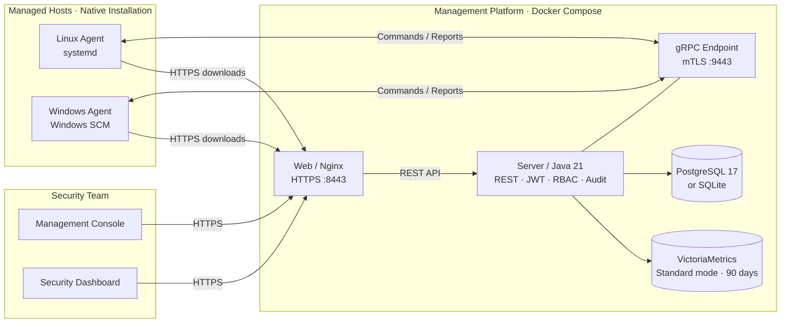
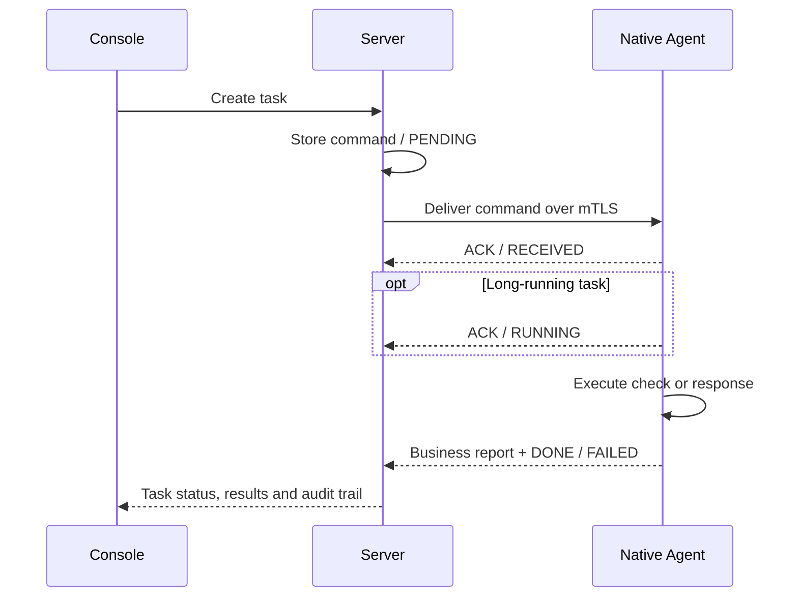
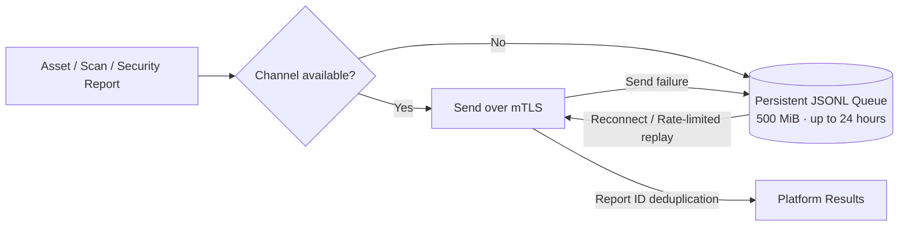

<div align="center">

# 🛡️ ALinkSec

### Unified Host Security & Operations

**Know your hosts. Find the risks. Take action with confidence.**

Asset inventory · Security baselines · Vulnerability remediation · Malware scanning<br/>Ransomware detection · Host isolation · Audit trails · Security dashboard

[English](README.md) · [简体中文](README-cn.md)

[](https://github.com/wybroot/alinksec/releases/tag/v0.0.1) [](https://github.com/wybroot/alinksec/actions/workflows/ci.yml) [](https://github.com/wybroot/alinksec/actions/workflows/release.yml) [](https://hub.docker.com/r/wangyanbiao/alinksec) [](LICENSE)

   

[Overview](#overview) · [Architecture](#architecture) · [Capabilities](#capabilities) · [Quick Start](#quick-start) · [Validation](#validation) · [Development](#development) · [Docs](#documentation)

</div>

---

<a id="overview"></a>

## ✨ From Host Visibility to Security Response

ALinkSec brings host inventory, security checks, threat detection and response
into one management platform. A native Go Agent collects evidence on each host;
the server coordinates policies and tasks over gRPC mTLS; the web console gives
security teams a shared view of assets, findings, alerts and execution results.

Follow a finding from discovery to remediation without switching tools: inspect
the affected host, launch a check, review the result, approve a response and keep
the operation in the audit trail. The same console also provides a dedicated
security dashboard at `/screen` for an at-a-glance view of the environment.

### At a Glance

| 💻 Native Agents | 📡 Observable Commands | 🛂 Access Control |
| :---: | :---: | :---: |
| **Linux & Windows**<br/>Single binary · systemd / Windows SCM | **11 command types**<br/>Receipt, execution and terminal ACKs | **3 roles**<br/>Administrator · Operator · Viewer |
| **2 deployment modes**<br/>PostgreSQL or lightweight SQLite | **500 MiB offline queue**<br/>Persistent reports · 24-hour retention limit | **15-minute uninstall token**<br/>Authorized · Expiring · Single use |

> **Lightweight by design:** short native Linux measurements recorded about
> **20 MiB idle RSS** and **0.80% of one CPU core** at idle. These are measured
> samples, not workload guarantees. See [validation and scope](#validation).

### Capability Map

| Domain | What You Can Do |
| --- | --- |
| 🖥️ **Hosts & assets** | Enroll hosts with mTLS; track heartbeats, software, processes, ports, accounts and disks; inspect read-only Linux container and local Kubernetes workload inventory. |
| 📋 **Security baselines** | Run structured checks, update check definitions without replacing the Agent, inspect noncompliant items and apply verified configuration repairs. |
| 🔎 **Risk discovery** | Scan for vulnerabilities, weak passwords and high-risk ports; review findings alongside the affected host's inventory. |
| 🧩 **Package remediation** | Approve per-host fixes, schedule maintenance windows, distribute offline patches and collect execution results. |
| 🦠 **Malware scanning** | Run quick, full or custom scans using SHA256 signatures and rules; quarantine, restore or delete detections; maintain allowlists and update signatures. |
| 🛡️ **Host protection** | Detect suspicious process behavior, ransomware decoy changes and encryption-rate anomalies; isolate and recover hosts; monitor Linux file integrity and SSH logins. |
| ⚙️ **Agent operations** | Observe command ACKs, replay persistent offline reports, recover native services, distribute Agent updates and authorize uninstall. |
| 📊 **Security operations** | Work with host lists, tasks, alerts, webhooks, reports and the security dashboard; control access with RBAC and review audit logs. |

Built-in file and login protection defaults to alerts. Enable restoration,
blocking and other automatic responses deliberately for each environment.
Container inventory adds host security context; it does not manage workloads.

---

<a id="architecture"></a>

## 🏗️ Architecture

**Containerized management. Native endpoint protection. Encrypted communication.**



The Agent is a native single binary. Managed hosts do not need Docker, a JRE,
Node.js or a Go toolchain. **v0.0.1** ships Linux amd64 containers and Linux
amd64 / Windows amd64 Agents.

The current development branch adds **Linux ARM64 (aarch64)** Agents and
amd64/arm64 container builds, with native CI for both architectures. ARM64 is
not included in the existing v0.0.1 release. Until a new release is published,
use the source build instructions in the [ARM64 guide](docs/14-ARM64支持.md).

<details>
<summary><b>📦 Explore the Repository</b></summary>

```text
alinksec/
├── agent/                       Native Go Agent
│   ├── cmd/agent/               run · install · uninstall · version
│   └── internal/
│       ├── comm/                gRPC · ACKs · offline queue · persistent state
│       ├── collector/           Host, container and workload inventory
│       ├── baseline/            Structured checks and allowlisted commands
│       ├── scan/                Vulnerability, password and port checks
│       ├── virusscan/           Signatures · rules · quarantine · allowlists
│       ├── fixer/               Configuration and package remediation
│       ├── guard/               Decoys · file/login protection · isolation
│       └── upgrade/             Verified downloads and binary replacement
├── server/                      Java / Spring Boot · five Maven modules
│   ├── alinksec-bootstrap/      Application startup and initial accounts
│   ├── alinksec-gateway/        REST API · authentication · authorization
│   ├── alinksec-service/        Tasks, reports and security services
│   ├── alinksec-proto/          Generated protocol bindings
│   └── alinksec-common/         Shared API types and utilities
├── web/                         Vue 3 console and security dashboard
├── proto/agent.proto            Commands, reports and acknowledgements
├── deploy/                      Compose · native services · release tooling
├── docs/                        Design, deployment and acceptance evidence
└── VERSION                      Shared product version
```

</details>

---

<a id="capabilities"></a>

## 🔬 Inside the Platform

### 📡 Commands You Can Follow From Start to Finish

Each command has an ID and a stored status. Receipt acknowledgements distinguish
delivery from execution; long-running tasks report progress stages; terminal
ACKs carry results or failure reasons. Pending commands can be delivered when
the host reconnects, and command deduplication limits repeated execution.



<details>
<summary><b>All 11 Command Types</b></summary>

| Command | Purpose |
| --- | --- |
| `baseline_check` | Security baseline checks |
| `vuln_scan` | Vulnerability, password and port checks |
| `vuln_fix` | Configuration or package remediation |
| `virus_scan` | Quick, full or custom malware scans |
| `virus_action` | Quarantine, restore or delete a detection |
| `signature_update` | Update the detection signature database |
| `policy_sync` | Synchronize host protection policies |
| `protect_action` | Block, unblock, stop a process, isolate or recover |
| `agent_upgrade` | Download, verify and replace the Agent binary |
| `collect_now` | Trigger selected collectors immediately |
| `agent_control` | Restart, pause/resume collection or arm uninstall |

</details>

### 💾 Reports That Survive Disconnection

Business reports generated while disconnected are persisted to a JSONL queue.
The Agent can reload that queue after a restart and replay it at a controlled
rate after reconnecting. Report IDs support deduplication on the server.



The queue is bounded: entries older than 24 hours or beyond its capacity are
evicted. Heartbeats, metrics and ACKs follow their own protocol behavior.

### 📋 Baselines and Remediation With Verification

Structured file-content, configuration-line and permission checks travel with
the task, so check definitions can change without rebuilding every Agent.
Command-output checks use an Agent-side allowlist. Configuration repairs follow
**backup → execute → verify**, with rollback attempted if execution or verification
fails, and the result returned to the platform.

Package fixes have a separate approval and maintenance-window workflow, with
per-host findings and offline patch delivery. Package installation reports
failures directly; it does not automatically roll back packages.

### 🦠 Malware Detection With Recoverable Quarantine

SHA256 signatures and rule matching support **quick**, **full** and **custom-path**
scans. Detected files can be quarantined with recovery metadata, then restored or
deleted by an authorized operator. Agent-side allowlists take effect before
detection. Signature updates reload the running engine and invalidate its clean
cache so newly added detections are applied without an Agent restart.

### 🛡️ Layered Host Protection

Ransomware decoys and encryption-rate monitoring complement process detection.
Linux file-integrity rules detect protected-file changes; SSH rules detect
brute-force attempts and logins outside configured hours. Policies can specify
trusted sources, excluded accounts, time zones and response actions.

Host isolation and recovery are managed through acknowledged commands, with
management-address allow rules and persistent isolation state. Firewall behavior
depends on the target platform and network configuration. See the
[file and login protection guide](docs/11-登录与文件防护.md) for policy details.

### 🔐 Protecting the Management Platform

| Layer | Mechanism |
| --- | --- |
| **Transport** | TLS for enrollment and HTTPS downloads; gRPC mTLS for enrolled Agent channels. |
| **Authentication** | JWT for console/API access, bcrypt password storage and configurable enrollment credentials. |
| **Authorization** | `admin`, `operator` and `viewer` roles; server-side checks on protected operations. |
| **Audit** | Operation records, credential redaction and CSV export; denied writes also leave an audit trail. |
| **Agent lifecycle** | SHA256 verification for updates; platform-authorized uninstall tokens expire after 15 minutes and are consumed once. |

---

<a id="quick-start"></a>

## 🚀 Quick Start

### Choose Your Deployment

| | 🪶 Lightweight | 🗄️ Standard |
| --- | --- | --- |
| **Database** | SQLite on a local persistent volume | PostgreSQL 17 with a least-privilege application account |
| **Persistent services** | `server` + `web` | PostgreSQL + VictoriaMetrics + `server` + `web` |
| **Metrics** | Disabled by default | VictoriaMetrics, 90-day retention |
| **Scope** | Initial 1–10 hosts; one server; no high availability guarantee | Standard database-backed deployment |
| **Compose file** | [docker-compose.lite.yml](deploy/docker/docker-compose.lite.yml) | [docker-compose.yml](deploy/docker/docker-compose.yml) |

Both modes use the same APIs and native Agent protocol. Keep SQLite data on
local storage rather than NFS/SMB. The example below uses lightweight deployment.
For standard deployment, follow sections 5 and 6 of the
[deployment guide](docs/06-部署文档.md), including database initialization.

### 1. Download Verified Release Assets

Get all five attachments from **[v0.0.1](https://github.com/wybroot/alinksec/releases/tag/v0.0.1)**:

| Asset | Contents |
| --- | --- |
| `alinksec-v0.0.1.tar.gz` | Source, deployment files and documentation |
| `alinksec-agent-linux-amd64` | Native Linux Agent |
| `alinksec-agent-windows-amd64.exe` | Native Windows Agent |
| `release-manifest.json` | Source commit, CI reference and image digests |
| `SHA256SUMS` | Checksums for the other four attachments |

Verify and extract them in the download directory:

```bash
sha256sum --check SHA256SUMS
tar -xzf alinksec-v0.0.1.tar.gz
cd alinksec-v0.0.1/deploy/docker
```

Published images are ready to pull; deployment hosts do not need to compile:

```text
wangyanbiao/alinksec:server-v0.0.1
wangyanbiao/alinksec:web-v0.0.1
wangyanbiao/alinksec:sqlite-maintenance-v0.0.1
```

### 2. Start the Management Platform

Copy the example configuration and replace its addresses and credentials:

```bash
cp .env.lite.example .env.lite
chmod 600 .env.lite
```

| Setting | Value to Configure |
| --- | --- |
| `HOST_IP` | Server IPv4 or DNS name that Agents can reach |
| `ALINKSEC_BIND_ADDRESS` | Specific local IPv4 address on the server |
| `ALINKSEC_BOOTSTRAP_ADMIN_PASSWORD` | Random initial administrator password, at least 12 characters |
| `ALINKSEC_BOOTSTRAP_ENROLL_TOKEN` | Random enrollment token starting with `ENROLL-` |
| `ALINKSEC_JWT_SECRET` | Random JWT signing secret |

Validate the configuration, pull images and start services **one at a time**:

```bash
docker compose --env-file .env.lite -f docker-compose.lite.yml config -q
docker compose --env-file .env.lite -f docker-compose.lite.yml pull server
docker compose --env-file .env.lite -f docker-compose.lite.yml pull web
docker compose --env-file .env.lite -f docker-compose.lite.yml --profile maintenance pull sqlite-maintenance
docker compose --env-file .env.lite -f docker-compose.lite.yml up -d --no-build --no-deps server
# Confirm initialization and check available memory before starting web.
docker compose --env-file .env.lite -f docker-compose.lite.yml up -d --no-build --no-deps web
docker compose --env-file .env.lite -f docker-compose.lite.yml cp server:/app/data/certs/ca.crt ./alinksec-ca.crt
```

Import `alinksec-ca.crt` into your browser trust store, then sign in with `admin`
and your configured initial password. Change that password after first login.

| Entry | URL |
| --- | --- |
| 🖥️ Management console | `https://<HOST_IP>:8443/` |
| 📊 Security dashboard | `https://<HOST_IP>:8443/screen` |

### 3. Connect a Native Agent

Transfer the matching binary and `alinksec-ca.crt` to each managed host. For
Linux, also copy `deploy/agent/alinksec-agent.service` from the release bundle
into that host's working directory as `alinksec-agent.service`:

On ARM64, use `alinksec-agent-linux-arm64` from the current source build or a
future release that includes ARM64; the published v0.0.1 Linux binary is amd64.

```bash
sudo install -m 0755 alinksec-agent-linux-amd64 /usr/local/bin/alinksec-agent
sudo /usr/local/bin/alinksec-agent install \
  --server <server-address>:9443 \
  --token <ENROLL-token> \
  --ca-file ./alinksec-ca.crt
sudo install -m 0644 alinksec-agent.service /etc/systemd/system/alinksec-agent.service
sudo systemctl daemon-reload
sudo systemctl enable --now alinksec-agent
systemctl status alinksec-agent
/usr/local/bin/alinksec-agent version
```

Enrollment writes the configuration and obtains a client certificate; the
native service then maintains the channel, heartbeats and collection.
Windows SCM installation, service recovery, maintenance and troubleshooting are
covered in the **[complete deployment guide](docs/06-部署文档.md)**.

<details>
<summary><b>🔌 Ports and Connectivity</b></summary>

| Port | Purpose | Clients |
| --- | --- | --- |
| `9443` | Agent enrollment and gRPC mTLS | Managed hosts |
| `8443` | HTTPS console, API and downloads | Browsers and managed hosts |
| `8081` | HTTP redirect to HTTPS | Browsers |
| `5432` / `8428` | PostgreSQL / VictoriaMetrics | Compose network only |

Configure allowed sources for the delivery environment. Agents need network
access to the management platform; they do not require Docker networks.

</details>

---

<a id="validation"></a>

## ✅ Release Validation & Scope

**v0.0.1 is the first development release.** Its development acceptance
checklist contains 28 items: **26 CLOSED, 1 ACCEPTED, 1 N/A**, with no OPEN or
VERIFY items. The [full CI](https://github.com/wybroot/alinksec/actions/runs/36978905551)
and [release workflow](https://github.com/wybroot/alinksec/actions/runs/36993494771)
passed for the published release.

| Verified Area | Evidence |
| --- | --- |
| **Linux workflows** | Actual Agent tasks, scanning, remediation and protection workflows in [functional acceptance](docs/10-本机全功能联动验收记录.md). |
| **Deployment & console** | Fresh deployments with both databases, browser workflows and release container smoke tests. |
| **Native Linux service** | Local binary installation, mTLS, assets, checks, file monitoring and automatic service recovery. |
| **Native Windows service** | Actual SCM, mTLS, assets, collection ACKs, stop/start and automatic recovery; see [native Agent evidence](docs/12-原生Agent本机验收记录.md). |

<details>
<summary><b>📈 Resource Measurements and Acceptance Boundaries</b></summary>

Native Linux sampling covered approximately 197 seconds, including startup,
idle operation, collection, a short baseline task, file monitoring and restart.

| Measurement | Observed Value |
| --- | --- |
| Idle CPU | Approximately **0.80% of one core** |
| Idle RSS | Approximately **20 MiB** |
| Peak RSS, including collection child processes | **47.48 MiB** |

These measurements do not cover long-running scans or sustained heavy workloads.
Windows SCM checks do not establish full Windows security-engine acceptance
with the Java platform. The 100–2000-host architecture target and every Linux
distribution or Windows version have not been validated. Multi-tenancy is not
implemented. See [acceptance status](docs/07-封版缺陷清单.md) and
[native Agent measurements](docs/12-原生Agent本机验收记录.md) for details.

Release CI checks all three full CI jobs on the exact source commit, reuses
the tested Agent binaries and smoke-tests the actual release containers before
publication. Artifacts include checksums and an image-digest manifest.

</details>

---

<a id="development"></a>

## 🧰 Development

| Layer | Stack | Role |
| --- | --- | --- |
| **Agent** | Go 1.24+ · gRPC · Protocol Buffers | Native collection, checks and local response |
| **Server** | Java 21 · Spring Boot 3.3.4 · five Maven modules | Host management, task orchestration and security APIs |
| **Console** | Vue 3 · Element Plus · ECharts · Vite | Security operations and dashboard |
| **Data** | PostgreSQL 17 / SQLite · VictoriaMetrics | Business records and optional time-series metrics |
| **Delivery** | Docker Compose · GitHub Actions · native services | Versioned images, verified binaries and deployment |

Use **Java 21**, **Go 1.24+** and **Node.js 22.22+**. [VERSION](VERSION) is the
product version source; CI checks Maven, Agent, npm and Compose versions for
consistency.

<details>
<summary><b>🔧 Local Build and Validation Commands</b></summary>

Run tests and builds serially while observing RAM, swap and memory pressure.
On low-memory machines, pause the backend before frontend bundling and follow
the resource limits in [AGENTS.md](AGENTS.md). Start only the services needed
for each check. Complete commands and prerequisites are in the
[validation reference](deploy/tests/README.md).

```bash
node deploy/release/check-version.mjs
node --test deploy/tests/release-gate.test.mjs

# Run the following stages sequentially.
cd server && mvn -B package
cd ../agent && go test ./...
cd ../web && npm ci && npm test && npm run build
```

</details>

Bug reports should include the version, platform, reproduction steps and
sanitized logs. Never include enrollment tokens, private keys or credentials.
For the release pipeline, see the [release process](docs/13-版本发布流程.md).

---

<a id="documentation"></a>

## 📚 Documentation

**Start here:** [Deployment Guide](docs/06-部署文档.md) ·
[Deployment Checklist](deploy/部署检查清单.md) ·
[Changelog](CHANGELOG.md) · [Release Process](docs/13-版本发布流程.md)

Detailed design and deployment documents are currently in Chinese; the
validation reference is in English.

<details>
<summary><b>Browse All Design and Acceptance Documents</b></summary>

| Document | Contents |
| --- | --- |
| [01 · Architecture](docs/01-总体架构与技术选型.md) | Implementation, component boundaries and design targets |
| [02 · Protocol](docs/02-通信协议设计.md) | gRPC, commands, reports, ACKs and mTLS |
| [03 · Databases](docs/03-数据库设计.md) | PostgreSQL, SQLite, metrics and schema |
| [04 · Agent Design](docs/04-Agent设计与策略规范.md) | Modules, policies and resource targets |
| [05 · Extended Capabilities](docs/05-扩展能力设计.md) | Malware, decoys, remediation and container inventory |
| [06 · Deployment](docs/06-部署文档.md) | Release assets, native installation, maintenance and troubleshooting |
| [07 · Acceptance Status](docs/07-封版缺陷清单.md) | Current status and defect-resolution evidence |
| [08 · Database Implementation](docs/08-双数据库轻量化部署改造计划.md) | Deployment boundaries and implementation history |
| [09 · Acceptance History](docs/09-剩余节点验收记录.md) | Serial validation and current conclusions |
| [10 · Functional Acceptance](docs/10-本机全功能联动验收记录.md) | Actual Linux Agent workflows |
| [11 · File & Login Protection](docs/11-登录与文件防护.md) | Linux SSH, file integrity and response policies |
| [12 · Native Agent Evidence](docs/12-原生Agent本机验收记录.md) | Linux resource sampling and actual Windows SCM checks |
| [13 · Releases](docs/13-版本发布流程.md) | CI gates, images, assets and credentials |
| [14 · ARM64](docs/14-ARM64支持.md) | Source builds, installation and multi-platform validation |
| [Validation Reference](deploy/tests/README.md) | Local checks, fixtures and resource constraints |

</details>

### 🧭 What's Next

- Broader Linux distribution and Windows security-engine acceptance.
- Sustained scan workloads and larger managed-host deployments.
- More complete delivery tooling and operator workflows.

### 🤝 License & Contributions

ALinkSec is released under the [Apache License 2.0](LICENSE). Issues and pull
requests are welcome; include the relevant validation evidence for code changes.

<div align="center">

---

**ALinkSec · Visibility, protection and response in one place.**

[GitHub](https://github.com/wybroot/alinksec) · [Releases](https://github.com/wybroot/alinksec/releases) · [Docker Hub](https://hub.docker.com/r/wangyanbiao/alinksec) · [简体中文](README-cn.md)

</div>
