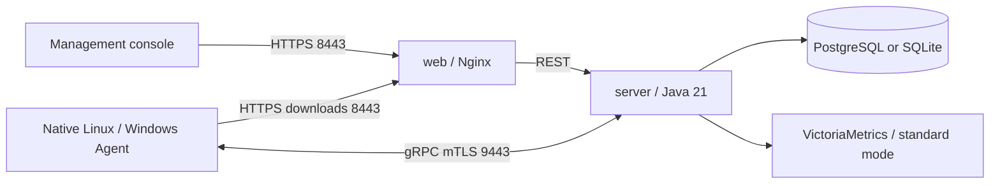

# ALinkSec

[English](README.md) | [简体中文](README-cn.md)

Host security management platform. **v0.0.1** is the first development release.
The server and web console run in containers; native Linux and Windows Agents
run on managed hosts and communicate over a network that can reach the server.

[Deployment guide](docs/06-部署文档.md) · [Release](https://github.com/wybroot/alinksec/releases/tag/v0.0.1) · [Docker Hub](https://hub.docker.com/r/wangyanbiao/alinksec) · [Release process](docs/13-版本发布流程.md) · [Changelog](CHANGELOG.md)

## Features

| Area | Implemented capabilities |
| --- | --- |
| Hosts and assets | mTLS enrollment, heartbeats, software, ports, processes, accounts and disks; read-only Linux container and local Kubernetes workload inventory |
| Baselines and scans | Structured checks, allowlisted commands, configuration repair and verification, vulnerability, weak-password and high-risk port scans |
| Package remediation | Per-host findings, administrator approval, maintenance windows, offline patches and execution results |
| Malware scanning | SHA256 and rule detection, scan tasks, quarantine and restore, allowlists and signature updates |
| Protection | Process behavior, ransomware decoys and encryption-rate detection, host isolation and recovery; Linux file integrity and SSH login detection |
| Operations | Command acknowledgements, persistent offline reports across restarts, native service recovery, Agent updates and authorized uninstall |
| Console | Host pagination and tasks, alerts and webhooks, three-role RBAC, audit logs, reports and security dashboard |

Built-in file and login protection defaults to alerts. Configure automatic
restoration, blocking and other responses for each environment. Container
inventory provides host security context; it does not manage container lifecycles.

## Deployment Modes

| Mode | Persistent services | Scope |
| --- | --- | --- |
| PostgreSQL | PostgreSQL 17, VictoriaMetrics, server, web | Standard deployment, least-privilege application database account, 90-day metrics |
| SQLite | server, web | 1-10 hosts, one server, local persistent volume, metrics disabled by default, no high availability guarantee |

Agents install natively. Managed hosts do not need Docker, a JRE, Node.js or Go.
v0.0.1 provides Linux amd64 containers and Linux amd64 / Windows amd64 Agents.



## Quick Start

Download all five assets from the [v0.0.1 release](https://github.com/wybroot/alinksec/releases/tag/v0.0.1),
then verify and extract them in the download directory:

```bash
sha256sum --check SHA256SUMS
tar -xzf alinksec-v0.0.1.tar.gz
cd alinksec-v0.0.1/deploy/docker
```

The release CI builds these images, so deployment hosts do not need to compile:

```text
wangyanbiao/alinksec:server-v0.0.1
wangyanbiao/alinksec:web-v0.0.1
wangyanbiao/alinksec:sqlite-maintenance-v0.0.1
```

For lightweight deployment, configure `.env.lite`: `HOST_IP` is the address
Agents use to reach the server; `ALINKSEC_BIND_ADDRESS` is a specific local IPv4
address on the server. Replace the example address and set a random initial
administrator password of at least 12 characters, a random enrollment token
starting with `ENROLL-`, and a JWT secret.

```bash
cp .env.lite.example .env.lite
chmod 600 .env.lite
# Edit .env.lite with your actual addresses and credentials
docker compose --env-file .env.lite -f docker-compose.lite.yml config -q
docker compose --env-file .env.lite -f docker-compose.lite.yml pull server
docker compose --env-file .env.lite -f docker-compose.lite.yml pull web
docker compose --env-file .env.lite -f docker-compose.lite.yml --profile maintenance pull sqlite-maintenance
docker compose --env-file .env.lite -f docker-compose.lite.yml up -d --no-build --no-deps server
# Confirm server initialization and check available memory before starting web
docker compose --env-file .env.lite -f docker-compose.lite.yml up -d --no-build --no-deps web
docker compose --env-file .env.lite -f docker-compose.lite.yml cp server:/app/data/certs/ca.crt ./alinksec-ca.crt
```

Import the platform CA into your browser trust store, open
`https://<HOST_IP>:8443/`, and sign in as `admin` with your configured password.
The security dashboard is at `/screen`. Standard deployment uses `.env.example`
and `docker-compose.yml`, requires two distinct PostgreSQL passwords, and starts
services in order as described in sections 5 and 6 of the [deployment guide](docs/06-部署文档.md).

Transfer the matching Agent binary and `alinksec-ca.crt` to each managed host.
Linux example:

```bash
chmod 755 alinksec-agent-linux-amd64
sudo ./alinksec-agent-linux-amd64 install --server <server-address>:9443 --token <ENROLL-token> --ca-file ./alinksec-ca.crt
./alinksec-agent-linux-amd64 version
```

After enrollment, install a systemd or Windows SCM service using section 8 of
the deployment guide. The Linux unit ships at `deploy/agent/alinksec-agent.service`.

## Validation and Limits

The development acceptance checklist has 28 items: 26 CLOSED, one ACCEPTED and
one N/A, with no OPEN or VERIFY items. Actual Linux workflows, fresh deployments
with both databases, browser behavior and a native Agent have been tested.
Windows SCM tests cover mTLS, assets, collection acknowledgements, service
stop/start and automatic recovery. They do not establish full Windows security
engine acceptance with the Java platform.

Short native Linux sampling measured about 0.80% of one CPU core at idle,
approximately 20 MiB idle RSS and a 47.48 MiB peak including collection child
processes. Long-running scans, the 100-2000-host design target and every Linux
distribution or Windows version have not been validated. See the
[functional acceptance](docs/10-本机全功能联动验收记录.md) and
[native Agent evidence](docs/12-原生Agent本机验收记录.md).

Run local tests and builds serially while observing RAM, swap and memory pressure.
Guard heavy builds, pause the backend when needed, and avoid starting the full
Compose stack on low-memory machines. See [validation commands](deploy/tests/README.md).
Release CI requires all three full CI jobs on the exact commit, reuses tested
Agents, and smoke-tests the actual release containers before publication.

## Development

Use Java 21, Go 1.24+ and Node.js 22.22+. `VERSION` identifies the product version;
CI checks Maven, Agent, npm and Compose image versions for consistency.
The server has five Maven modules, the console uses Vue 3 / Element Plus /
ECharts, and the Agent is written in Go.

```bash
node deploy/release/check-version.mjs
node --test deploy/tests/release-gate.test.mjs
# Run builds and tests sequentially, following AGENTS.md resource constraints
cd server && mvn -B package
cd ../agent && go test ./...
cd ../web && npm ci && npm test && npm run build
```

## Documentation

Detailed design and deployment documents are currently in Chinese; the
validation reference is in English.

| Document | Contents |
| --- | --- |
| [01 Architecture](docs/01-总体架构与技术选型.md) | Current implementation and design targets |
| [02 Protocol](docs/02-通信协议设计.md) | gRPC, commands, reports and mTLS |
| [03 Databases](docs/03-数据库设计.md) | PostgreSQL, SQLite, metrics and schema |
| [04 Agent design](docs/04-Agent设计与策略规范.md) | Modules, policies and resource targets |
| [05 Extended capabilities](docs/05-扩展能力设计.md) | Malware, decoys, remediation and container inventory |
| [06 Deployment](docs/06-部署文档.md) | Release assets, installation, maintenance and troubleshooting |
| [07 Defects](docs/07-封版缺陷清单.md) | Current status and historical evidence |
| [08 Database implementation](docs/08-双数据库轻量化部署改造计划.md) | Deployment boundaries and implementation history |
| [09 Acceptance history](docs/09-剩余节点验收记录.md) | Serial validation and current conclusions |
| [10 Functional acceptance](docs/10-本机全功能联动验收记录.md) | Actual Linux Agent workflows |
| [11 File and login protection](docs/11-登录与文件防护.md) | Linux SSH, integrity and responses |
| [12 Native Agent](docs/12-原生Agent本机验收记录.md) | Linux resource samples and actual Windows SCM tests |
| [13 Releases](docs/13-版本发布流程.md) | CI gates, images, assets and credentials |
| [Deployment checklist](deploy/部署检查清单.md) | Installation acceptance steps |

Future work includes broader platform coverage, sustained workload tests and
delivery improvements. Multi-tenancy is not implemented.
