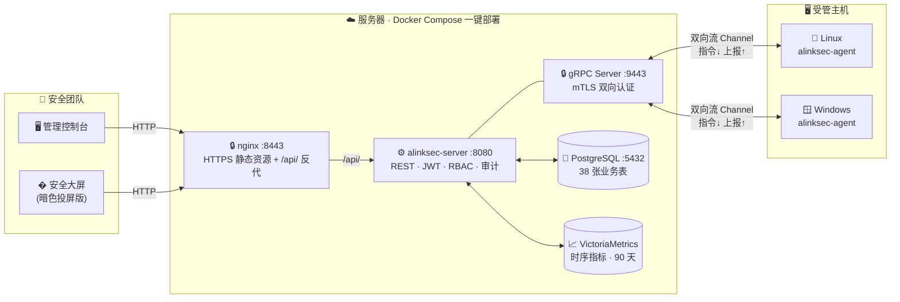
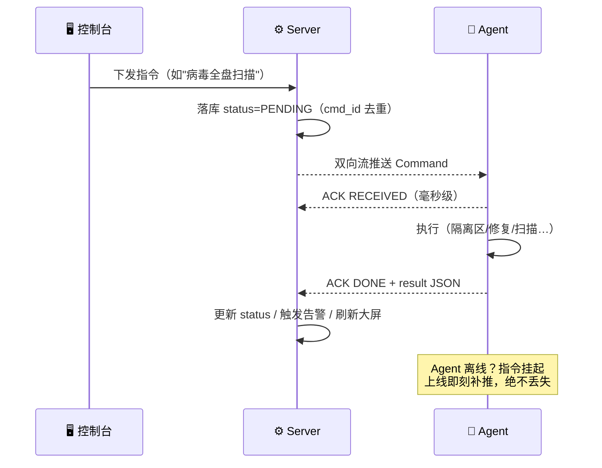
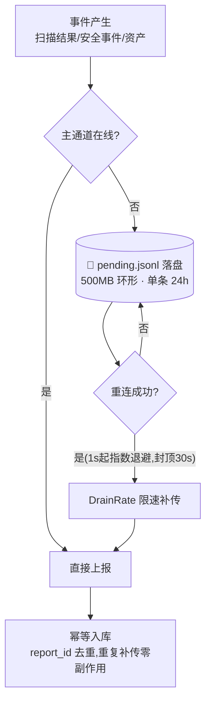
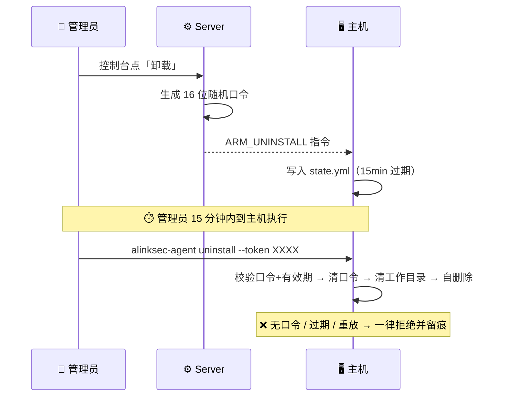

<div align="center">

<br />

# 🛡️ ALinkSec · 主机安全管控平台

### *Enterprise-Grade Endpoint Security Platform*
### **一体化终端安全管理系统 · Agent 采集 → gRPC mTLS → 智能分析 → 一键处置**

**资产清点 · 基线核查 · 漏洞管理 · 病毒查杀 · 勒索诱饵 · 主机隔离 · 灰度升级 · 安全大屏 · 审计与 RBAC**

<p>


</p>

<p>


</p>

---

### 💔 你是否也面临这些困境？

> � **主机上跑了什么软件、开了什么端口、有哪些账户？** —— 没人说得清，出了事才去翻
>
> � **几百台机器逐台做等保基线核查？** —— 人工检查一周起步，还漏检
>
> 📛 **弱口令、高危端口、老旧组件漏洞** —— 攻击者的首选入口，却散落在各处无人收敛
>
> 📛 **勒索病毒加密文件时** —— 只能眼睁睁看着，没有诱捕、没有自动隔离
>
> 📛 **安全产品装了一堆** —— 各自为战，没有统一控制台、没有审计、没有权限分立

**ALinkSec 用一个平台、一套 Agent、一块大屏，把这些全部收敛。**

</div>

---

## 📊 一图看懂数字

```
┌──────────────────────────────────────────────────────────────────────────────┐
│   2  个平台         11  种指令类型        10  种上报类型        7  类安全事件   │
│  Linux/Win        全 ACK 状态机闭环      心跳/资产/扫描/病毒   进程篡改/爆破/勒索…│
├──────────────────────────────────────────────────────────────────────────────┤
│  37  张业务表      500MB  断网落盘队列    90  天指标留存       15min  卸载口令  │
│  PG 全量建模       24h 环形淘汰补传      VictoriaMetrics      一次性防重放    │
├──────────────────────────────────────────────────────────────────────────────┤
│  3  角色 RBAC      4×6  基线断言矩阵     3650 天客户端证书    30s  重连退避封顶│
│  admin/op/viewer   4 检查型×6 比较器     注册即签发           指数退避 1s 起  │
└──────────────────────────────────────────────────────────────────────────────┘
```

---

## 🏗️ 系统架构



<details>
<summary><b>📦 目录结构</b>（点击展开）</summary>

```
alinksec/
├── proto/agent.proto          # 通信协议：11 种指令 / 10 种上报 / ACK 状态机
├── agent/                     # 🐹 Go Agent（单二进制，systemd / Windows 服务）
│   ├── cmd/agent/             #    入口：run / install / uninstall 子命令
│   └── internal/
│       ├── comm/              #    gRPC 通道 · 指令分发 · ACK · 断线队列 · 状态持久化
│       ├── collector/         #    资产采集（软件/端口/账户/磁盘）
│       ├── baseline/          #    基线引擎（结构化检查热更新，命令型检查白名单）
│       ├── scan/              #    漏洞 / 弱口令 / 高危端口扫描
│       ├── virusscan/         #    病毒引擎（SHA256 特征库 + 规则匹配 + 隔离区）
│       ├── fixer/             #    修复执行器（备份→执行→复核→失败回滚）
│       ├── guard/             #    勒索诱饵 · 加密速率监控 · 主机隔离 · 进程查杀
│       └── upgrade/           #    自升级（sha256 校验 / 原子替换 / 拉起）
├── server/                    # ☕ Java 服务端（Maven 多模块）
│   ├── alinksec-bootstrap/    #    启动模块（种子账号 / 注册码 / 配置）
│   ├── alinksec-gateway/      #    REST 层（JWT / RBAC 拦截器 / 审计 Filter）
│   ├── alinksec-service/      #    业务层（注册 / 心跳 / 指令 / 各安全域服务）
│   ├── alinksec-proto/        #    protobuf 生成物
│   └── alinksec-common/       #    错误码 / ApiResult / 工具
├── web/                       # 🎨 Vue3 前端（控制台 + 安全大屏 /screen）
├── deploy/
│   ├── docker/                # compose + Dockerfile×2 + nginx.conf
│   └── sql/                   # 001_init.sql 首启建表脚本
└── docs/                      # 📚 设计文档 01~05 + 部署文档 06
```

</details>

---

## ✨ 核心能力深挖

### 1️⃣ 指令闭环 —— 每一次下发都可观测、可追溯

不是"发射后不管"：每条指令经历完整 ACK 状态机，平台实时看到 Agent 何时收到、执行结果如何，失败原因原样回传。



**11 种指令全类型**：`baseline_check` 基线核查 · `vuln_scan` 漏洞扫描 · `vuln_fix` 漏洞修复 · `virus_scan` 病毒扫描 · `virus_action` 病毒处置 · `signature_update` 特征库热更 · `policy_sync` 策略同步 · `protect_action` 防护动作(隔离/查杀) · `agent_upgrade` 灰度升级 · `collect_now` 即时采集 · `agent_control` Agent 控制

---

### 2️⃣ 断网不丢数据 —— 环形落盘队列

主机断网 / 服务端重启期间，所有上报自动落盘，恢复后**限速补传**防止打爆服务端。



---

### 3️⃣ 防恶意卸载 —— 动态口令布防

直接在主机上敲 `uninstall`？没门。口令由平台布防、**15 分钟过期、一次性消费、先清口令再执行**（防重放）。



---

### 4️⃣ 勒索诱饵 + 加密行为检测 —— 主动诱捕

- 🍯 **蜜罐诱饵文件**：在高价值目录布放诱饵（正常业务绝不触碰），任何篡改即刻触发 `decoy_tamper` 事件
- ⚡ **加密速率监控**：检测文件被高频改写的勒索特征（`ransom_behavior`），速率超阈自动告警
- � **自动响应**：可配置自动查杀恶意进程 / 一键主机隔离，把损失半径压到最小

**7 类安全事件全覆盖**：`process` 可疑进程 · `file_tamper` 文件篡改 · `login_crack` 登录爆破 · `self_defense` 自保护触发 · `virus` 病毒检出 · `decoy_tamper` 诱饵触碰 · `ransom_behavior` 勒索行为

---

### 5️⃣ 基线核查 —— 结构化检查热下发，命令型检查受控

文件内容、配置行与权限等结构化检查项 JSON 随指令下发，可在不升级 Agent 的情况下更新。`cmd_output` 仅执行 Agent 内置白名单命令，新增命令型检查必须随 Agent 版本发布，不提供远程 Shell 或脚本下发能力。

| 维度 | 说明 |
|---|---|
| **4 种检查类型** | `file_content` 文件内容 · `file_line` 配置行 · `file_perm` 文件权限 · `cmd_output` 白名单命令输出 |
| **6 种断言器** | `eq` / `ne` / `contains` / `not_contains` / `regex` / 版本比较 |
| **自动修复** | 改前备份 → 执行修复 → 复核结果 → **失败自动回滚**，绝不把主机改坏 |
| **任务化** | 勾选模板 + 目标主机 → 批量执行 → 不合规项清单 + 修复建议 |

---

### 6️⃣ 病毒查杀 —— 特征库热更新

- 📦 特征库（`manifest.json` + `hashes.txt` SHA256 黑名单）平台侧导入，**心跳版本比对 → 自动推送 → Agent 热加载**，全程无需重启
- 🔍 三种扫描模式：快速扫描 / 全盘扫描 / 自定义目录
- 🧪 隔离区机制：染毒文件移入隔离区（非直接删除），支持恢复 / 删除 / 加白名单
- ⚖️ 白名单优先：管理员可信文件永不误报

---

### 7️⃣ 主机隔离 —— 断业务、保管理

iptables 专用链 `ALINKSEC_ISO` 挂载 INPUT/OUTPUT 首位：

```
✅ 放行 lo 回环            —— 本机进程不受影响
✅ 放行 ESTABLISHED        —— 已建连接优雅收尾
✅ 放行 服务器 IP           —— 管理通道始终在线，可随时解除
❌ 其余全部 DROP            —— 横向移动 / 数据外传立刻切断
```

支持 nftables-only 系统（自动降级 `iptables-nft` 后端），平台一键隔离/解除，全程 ACK 闭环。

---

### 8️⃣ 平台安全 —— 为"安全产品"自身上保险

| 层面 | 机制 |
|---|---|
| 🔑 **接入** | gRPC mTLS 双向认证 · 自建 CA · Agent 注册即签发客户端证书（3650 天）· 一次性注册码（次数/有效期可控，默认 10 次/7 天） |
| 🎫 **认证** | REST JWT（密钥环境变量注入或首启生成持久化）· 密码 bcrypt 存储 · 首登强制改密 |
| 🛂 **授权** | RBAC 三角色写拦截：`admin` 全权限 / `operator` 安全处置（禁平台管理）/ `viewer` 只读 —— 越权 403 **同样落审计** |
| 📝 **审计** | 全 REST 写操作留痕：操作人 / IP / 耗时 / 响应码 / 请求体摘要（登录改密自动脱敏），支持 CSV 合规导出 |
| 🧨 **防卸载** | 16 位动态口令 · 15min 有效 · 一次性消费 · 先清口令再执行 |
| 📦 **数据可靠** | 断网落盘补传 · `report_id` 幂等 · `cmd_id` 去重 · 指令离线挂起补推 |

---

## 🆚 为什么不手工 / 不用单一工具？

| 能力 | 😫 手工运维 | 😐 单点脚本 | 😎 ALinkSec |
|---|---|---|---|
| 500 台主机资产清点 | 逐台登机，一周起 | 各自为战，格式不一 | **一键采集，统一台账** |
| 等保基线核查 | 逐项人工比对 | 脚本写死，无法热更 | **结构化检查热下发 + 命令白名单 + 自动修复 + 回滚** |
| 弱口令/高危端口 | 出事后翻日志 | 定时跑，结果没人看 | **实时告警 + 大屏 + 处置闭环** |
| 勒索病毒响应 | 看到加密已晚 | 无诱捕无隔离 | **诱饵诱捕 + 速率检测 + 一键隔离** |
| 操作审计 | 没有 | 散落 shell history | **全量落库 + RBAC + CSV 导出** |
| 断网期间数据 | 丢失 | 丢失 | **落盘补传，零丢失** |

---

## 部署模式

| 模式 | 组成 | 适用范围 | 启动文件 |
|---|---|---|---|
| 生产模式 | PostgreSQL 17 + VictoriaMetrics + server + web | 正式环境、持续运行与后续扩容 | `deploy/docker/docker-compose.yml` |
| 轻量模式 | SQLite WAL + server + web | 开发、演示、初始 1～10 台受管主机 | `deploy/docker/docker-compose.lite.yml` |

两种模式使用同一套业务接口与 Agent 协议。SQLite 为单实例部署，默认关闭时序指标，不支持高可用，数据库文件不得放在 NFS/SMB；正式上线与 PostgreSQL 兼容性仍以生产模式验证为准。

## �🚀 快速开始

> ⏱️ **服务器两条命令 + 目标主机一条命令**，从零到平台跑起来

### ① 本机构建发布包（Windows PowerShell）

```powershell
# Agent 交叉编译 Linux amd64（Windows 版改 GOOS=windows）
cd agent
$env:GOOS="linux"; $env:GOARCH="amd64"
go build -o ..\release-bin\alinksec-agent ./cmd/agent
$env:GOOS=""; $env:GOARCH=""; cd ..
```

### ② 服务器部署（Docker Compose）

生产模式：

```bash
# 发布包必须包含完整 server/、proto/、web/、deploy/ 目录；打包命令见部署文档 §2。
unzip alinksec-release.zip -d ~/alinksec && cd ~/alinksec/deploy/docker

cp .env.example .env && vim .env     # ⚠️ HOST_IP / ALINKSEC_BIND_ADDRESS 必须改成服务器真实地址
# 同时设置 ALINKSEC_BOOTSTRAP_ADMIN_PASSWORD（至少 12 位）和
# ALINKSEC_BOOTSTRAP_ENROLL_TOKEN（随机 ENROLL- 前缀字符串）、
# 两个不同的 PostgreSQL 初始化/应用密码、ALINKSEC_JWT_SECRET；随后执行 chmod 600 .env

docker compose config -q && docker compose build && docker compose up -d

docker compose ps -a               # migrate 必须为 Exited (0)
docker compose logs server | grep -E "gRPC|Bootstrap"
# 👉 仅确认初始化成功；凭据使用 .env 中配置的值，不会打印到日志
docker cp alinksec-server:/app/data/certs/ca.crt ./alinksec-ca.crt
# 浏览器访问控制台前，将 alinksec-ca.crt 导入其信任库。
```

轻量模式不需要 PostgreSQL 和 VictoriaMetrics：

```bash
cd ~/alinksec/deploy/docker
cp .env.lite.example .env.lite
vim .env.lite
chmod 600 .env.lite

docker compose --env-file .env.lite -f docker-compose.lite.yml config -q
docker compose --env-file .env.lite -f docker-compose.lite.yml build
docker compose --env-file .env.lite -f docker-compose.lite.yml up -d --wait
```

SQLite 在线备份与校验：

```bash
cd ~/alinksec
bash deploy/sqlite-maintenance.sh backup
# 恢复会先创建 pre-restore 快照，再停止 server；失败时自动回滚：
bash deploy/sqlite-maintenance.sh restore <备份文件名.db> --yes
```

### ③ 目标主机接入（Linux 示例）

```bash
sudo ./alinksec-agent install --server <服务器IP>:9443 --token <ENROLL-注册码> --ca-file ./alinksec-ca.crt
# 注册 → 签发客户端证书 → 建立双向流通道 → 首次资产采集自动上报
# 前台试跑确认「主通道已建立」后，配 systemd / Windows 服务常驻（部署文档 §8）
```

### ④ 登录使用

| 入口 | 地址 | 说明 |
|---|---|---|
| 🖥️ 管理控制台 | `https://<IP>:8443/` | admin / `.env` 中的初始密码 |
| 📺 安全大屏 | `https://<IP>:8443/screen` | 暗色投屏版 · 大屏轮播 · 只读 |

> 📖 **完整部署手册**：38 张业务表 + 版本化迁移 → 最小权限数据库账号 → 来源网段限制 → 10 项端到端联调
> **👉 [docs/06-部署文档.md](docs/06-部署文档.md)**

<details>
<summary><b>🔧 端口清单与防火墙策略</b>（点击展开）</summary>

| 端口 | 协议 | 用途 | 放行对象 |
|---|---|---|---|
| 9443 | gRPC mTLS | Agent 接入（注册/心跳/双向流） | 全部受管主机 |
| 8443 | HTTPS | Web 控制台、API 与 Agent 包下载 | 安全团队和受管主机 |
| 8081 | HTTP | 仅重定向至 HTTPS | 浏览器 |
| 5432 / 8428 | — | PG / VM（仅 compose 内网） | 不暴露宿主机 |

</details>

---

## 🧰 技术栈

| 层 | 技术 | 选型理由 |
|---|---|---|
| **Agent** | Go 1.24 · gopsutil v4 · grpc 1.66 | 单二进制零依赖，交叉编译覆盖 Linux/Windows，资源占用低 |
| **服务端** | Java 21 · Spring Boot 3.3 · gRPC · protobuf | 虚拟线程承载长连接双向流，生态成熟易扩展 |
| **前端** | Vue 3.4 · Element Plus 2.7 · ECharts 5.5 · Vite 5 | 组合式 API + 暗色大屏，开发体验与渲染性能兼得 |
| **存储** | PostgreSQL 17 / SQLite 3（业务）· VictoriaMetrics（时序） | 正式环境与轻量验证分档，生产模式保留独立时序存储 |
| **部署** | Docker Compose · nginx | 一条命令全家桶起，反代统一 8081 入口 |

---

## 📚 文档索引

| # | 文档 | 内容 |
|---|---|---|
| 01 | [总体架构与技术选型](docs/01-总体架构与技术选型.md) | 架构 · 里程碑 · 容量规划 · 安全设计 |
| 02 | [通信协议设计](docs/02-通信协议设计.md) | gRPC 协议 · 指令/上报定义 · ACK 状态机 · mTLS |
| 03 | [数据库设计](docs/03-数据库设计.md) | 38 张表结构 · 索引 · 幂等设计 |
| 04 | [Agent设计与策略规范](docs/04-Agent设计与策略规范.md) | Agent 模块 · 策略下发 · 断线行为 |
| 05 | [扩展能力设计](docs/05-扩展能力设计.md) | 病毒引擎 · 诱饵防护 · 升级 · 扩展路线 |
| 06 | [部署文档](docs/06-部署文档.md) | ⭐ 逐步部署 · 端到端联调 · 排障手册 |
| 07 | [封版缺陷清单](docs/07-封版缺陷清单.md) | 封版阻断项 · 修复顺序 · 验收标准 |
| 08 | [双数据库轻量化部署改造计划](docs/08-双数据库轻量化部署改造计划.md) | PostgreSQL / SQLite 边界 · 实施与验收 |

---

## 🗺️ Roadmap

- [x] M1 主机接入 + 资产采集 + 心跳监控
- [x] M2 基线核查 + 漏洞/弱口令/高危端口扫描
- [x] M3 安全大屏 + 审计 + RBAC
- [x] M4 病毒查杀 + 勒索诱饵 + 灰度升级 + 特征库热更
- [x] 安全加固：卸载口令 / 断网队列 / RBAC 写拦截
- [x] M5 告警通道（Webhook 配置、管理员权限与失败重试）
- [x] Docker 容器清点与审计告警（Linux 只读采集）
- [x] Kubernetes 本机工作负载清点（宿主机 Agent 通过 kubectl 按节点只读采集）
- 容器信息仅作为宿主机安全研判上下文，不提供编排、发布、调度或生命周期管理
- [x] EDR 行为引擎（进程树 lineage + 规则热更）
- [ ] 长期低优先级：多租户隔离（暂不纳入近期版本）

---

<div align="center">

**⭐ 如果 ALinkSec 对你有帮助，欢迎 Star 让更多人看到！**

**🐞 联调中遇到任何问题？[部署文档 §12 排障表](docs/06-部署文档.md) 覆盖 18 个高频故障场景**

*ALinkSec — 让每一台主机都被认真守护* 🛡️

</div>
