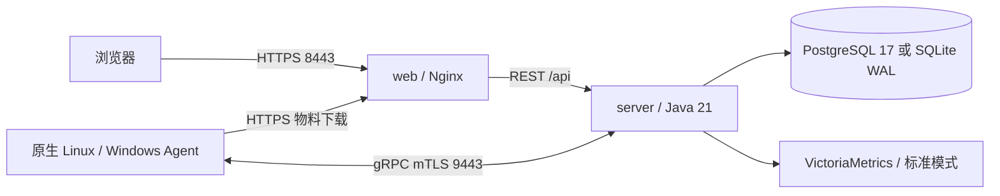

# ALinkSec 安全监测与管理平台 — 总体架构与技术选型

> 适用版本：v0.0.2；更新日期：2026-10-03。
> 本文保留规模目标和后续架构规划；变更及验证状态见 [发布说明](releases/v0.0.2.md)，安装及实际服务清单见 [部署文档](06-部署文档.md)。
> Linux ARM64 Agent、双架构镜像构建与原生 CI 已合并，合并提交的完整 CI 通过；正式发布仍需版本更新提交的 CI 和 Release 成功，见 [ARM64 支持](14-ARM64支持.md)。

## v0.0.2 实现基线

- server/web 支持 Linux amd64 / arm64 容器，受控终端使用 Linux amd64 / arm64 / Windows amd64 原生 Agent，网络可连通管理端即可接入。
- 标准模式只有 PostgreSQL 17、VictoriaMetrics、server、web 四个长期服务；初始化账号经一次性 `migrate` 创建最小权限应用账号。轻量模式只有 server/web，业务库为本机 SQLite WAL，默认关闭指标。
- Redis、RabbitMQ、MinIO 为后续扩展规划，当前运行不依赖这些组件。在线通道与任务调度在服务端管理，业务报告直接分发入库，物料保存在 `server-data` 卷。
- Java 21、Go 1.24+、Node.js 22.22+；Linux Agent 离线报告使用 `pending.jsonl`，不是 SQLite 队列。病毒引擎使用 SHA256 与内部规则匹配，当前未接入原生 YARA。
- Linux 全功能与原生成品通过实测；Windows 基础服务验证范围、短时资源采样及规模限制以发布说明为准，下面的规模、可用性和响应指标属于设计目标。

## 1. 项目定位

**形态**：服务端（Server）+ 主机探针（Agent）的主机安全监测与管理平台（HIDS 类产品）。

**核心能力**：

| 能力 | 说明 |
|------|------|
| 资产清点 | 主机/软件/端口/进程/账户自动清点，形成资产台账 |
| 实时监控 | CPU/内存/磁盘/网络等性能指标实时采集与可视化 |
| 基线核查 | 等保 2.0 / CIS 基线核查，策略模板化、可扩展 |
| 安全扫描 | 漏洞扫描（CVE 特征匹配）、弱口令检测、端口服务识别 |
| 实时防护 | 恶意进程阻断、关键文件防篡改、暴力破解封禁（用户态） |
| 病毒查杀 | SHA256 + 内部规则匹配，快速/全盘/实时扫描，隔离/恢复（详见 05 §1） |
| 勒索诱饵防护 | 诱饵文件 + 加密行为速率双触发，本地秒级阻断并隔离主机（详见 05 §2） |
| 漏洞一键修复 | 配置类自动修复（可回滚）；软件包类审批 + 维护窗口 + 离线补丁仓库（详见 05 §3） |
| 告警处置 | 安全事件告警、处置闭环（封禁/查杀/忽略） |
| 报表审计 | 合规报表、平台操作审计 |

**规模目标**：单套私有化部署管理 100 ~ 2000 台主机。

**支持系统**：Linux（CentOS 7+/Ubuntu 18+/统信/麒麟）+ Windows（Server 2016+ / Win10/11）。

## 2. 总体架构



server 的内部 HTTP 8080 不发布到宿主机。平台 CA、JWT 与上传物料保存于 `server-data`，Web 仅挂载叶证书和私钥。SQLite 模式只有 server/web 两个长期服务，维护工具按需运行。

## 3. 技术选型与版本锁定

| 分类 | 组件 | 版本（锁定） | 选型理由 |
|------|------|-------------|----------|
| 服务端框架 | Java + Spring Boot 3.x | Java 21 / SB 3.3.4 | 模块化单体 |
| 前端 | Vue 3 + Element Plus + ECharts | Vue 3.4+ | 团队主力栈；ECharts 支撑监控大屏 |
| Agent | Go | Go 1.24+ | 原生单二进制；linux/amd64、linux/arm64 与 windows/amd64 |
| 业务数据库 | PostgreSQL | 17.x | JSONB 存基线核查项/防护规则/告警详情等半结构化策略；原生分区与窗口函数支撑报表 |
| 时序数据库 | VictoriaMetrics（单机版） | v1.102+ | Apache 2.0 许可（可闭源商用）；压缩率高、单机即可承载 2000 台规模；PromQL/MetricsQL 查询 |
| 缓存（规划） | Redis | 未发布 | 后续在线态与限流扩展 |
| 消息队列（规划） | RabbitMQ | 未发布 | 后续上报削峰 |
| 对象存储（规划） | MinIO | 未发布 | 后续物料对象存储 |
| 通信协议 | gRPC + Protobuf | grpc 1.6x | 双向流支撑指令秒级下发；Protobuf 二进制编码降低带宽 |
| 部署 | Docker Compose | v2 | 私有化一键部署，贴合现场交付 |

**不引入的组件及原因**（避免过度设计）：

- **微服务框架（Spring Cloud）**：单体多模块 + 清晰包边界即可，未来有需要再拆。
- **vmalert / AlertManager**：告警规则与业务告警（登录失败、防篡改）耦合度高，由自研告警引擎统一处理，减少组件。
- **Elasticsearch**：一期日志以"采集→解析→事件"为主，原始日志不集中存储；如后续客户需要原始日志检索再引入。
- **TDengine**：AGPL 许可对闭源商业产品有传染风险。
- **InfluxDB**：2.x 维护模式、3.x 免费版仅 72h 保留，私有化商业产品能力不闭环。

## 4. 服务端模块划分（Maven 多模块）

```text
server/
├── alinksec-common       # API 结果、异常、JWT 等公共组件
├── alinksec-proto        # 从 proto/agent.proto 生成 Java / gRPC 类型
├── alinksec-service      # 业务处理、任务、指标和报告分发
├── alinksec-gateway      # REST、RBAC、审计、gRPC 注册与 Channel
└── alinksec-bootstrap    # 启动装配、内置数据与单个可运行 JAR
```

业务报告经 gateway 身份校验后直接分发入库；指标由服务端写入 VictoriaMetrics，轻量模式默认关闭。REST 创建任务并写入 `t_command`，服务端根据当前在线通道推送，ACK 按证书绑定的 Agent 更新状态，不使用外部 MQ 或 Redis 待推队列。

## 5. 关键链路设计

### 5.1 Agent 注册（首次安装）

```
安装命令: alinksec-agent install --server=10.0.0.1:9443 --token=ENROLL-XXXX --ca-file=ca.crt
   │
   ▼ ① TLS 连接 EnrollService（先验证管理员分发的平台 CA）
Enroll(token + 主机指纹 machine_id + HostInfo)
   │
   ▼ ② 服务端校验：token 有效性/未过期/未用尽 → machine_id 查重
生成 agent_id（UUID）+ 签发客户端证书（CN=agent_id，平台内置 CA）
   │
   ▼ ③ 返回 {agent_id, client_cert, client_key, ca_cert}
Agent 持久化证书至工作目录（0600）→ 后续所有连接 mTLS
```

- 注册码一次性，可配置使用次数与有效期（默认 24h）。
- `machine_id`（Linux: `/etc/machine-id`；Windows: MachineGuid）防止重复注册刷 agent。
- Agent 禁用/删除后，gateway 在建连时校验证书序列号 ↔ agent 状态，拒绝连接（简化 CRL）。

### 5.2 心跳与在线判定

- Agent 每 **10s** 上报 `RptHeartbeat`（含 agent_version、cpu/mem 概要、**policy_version**）。
- gateway 更新数据库中的心跳时间与在线状态，维护内存 Channel。
- job 每 15s 扫描：超过 30s 无心跳 → 状态置离线 → 产生一条"Agent 离线"告警（可配置）。
- 心跳携带 `policy_version`，与服务端当前版本不一致 → 立即下发 `CmdPolicySync`（策略自动收敛，无需人工）。

### 5.3 指令下发与执行

```
REST 创建任务 → t_command(PENDING) → 服务端在线通道
   → gateway 查连接表推送到 Agent stream（30s 未 ACK 自动重推，最多 3 次）
Agent 收到 → 回 ACK(接收) → 本地执行 → 回 ACK(结果)/专门 Report
   → t_command 状态机：PENDING→SENT→RECEIVED→RUNNING→SUCCESS/FAILED
```

幂等：Agent 维护 cmd_id LRU（1000 条）防重复执行。

### 5.4 实时防护链路（低延迟要求）

- 安全事件（如挖矿进程）由 **Agent 本地 guard 引擎自主判定并处置**（kill/封 IP），同时上报事件——不依赖服务端在线，断网防护不失效。
- 服务端处置指令（人工封禁 IP、查杀进程）通过同一 gRPC stream 下发，端到端延迟 < 1s。

## 6. 非功能设计

### 6.1 安全

| 项 | 方案 |
|----|------|
| Agent ↔ Server | mTLS 双向认证；证书 CN=agent_id，指纹绑定身份 |
| 注册 | 一次性 token + machine_id 防重放/防伪造 |
| 平台登录 | JWT（2h）+ bcrypt 密码 + 登录失败锁定（5 次/15min） |
| 权限 | RBAC（超级管理员/安全运维/只读审计），权限点存 role.permissions JSONB |
| 审计 | 平台所有写操作（登录/策略变更/处置/导出）入审计表，含来源 IP |
| Agent 卸载 | 需平台生成的动态口令，防止恶意卸载绕过防护 |
| 物料文件 | server-data 持久化，下载校验平台 CA 与 SHA256 |

### 6.2 可靠性

- **Agent 断网自治**：策略与状态缓存到本机文件；断网时 guard 照常工作，业务报告进入 `pending.jsonl` 环形队列（上限 24h 或 500MB），重启后可补传。
- **Agent 自愈**：Linux systemd `Restart=always`；Windows 服务恢复策略（失败 5s 重启）。
- **Server 重启**：在线通道为进程内状态，Agent 在服务恢复后自动重连；任务、策略、证书和物料持久化。
- **数据可靠性**：PG 每日全量 + WAL 归档；VM 数据可容忍丢失（可从指标重建的仅监控数据，保留 90d）。

### 6.3 性能与容量估算

| 项 | 估算（2000 台满配） |
|----|---------------------|
| 心跳/指令 | 2000 长连接，gRPC 单进程可承载（每连接内存 ~100KB，约 200MB） |
| 指标写入 | 2000 × ~30 序列 × 0.1Hz ≈ 6000 点/s → VM 单机（可承载百万点/s）轻松覆盖 |
| 指标存储 | VM 压缩后 ~0.5-1 字节/点 → 每日 ~250-500MB → 90 天保留约 25-50GB |
| 业务写入 | 基线核查任务（2000 台 × 60 项）峰值 MQ 削峰后批量入库 |
| 资源建议 | 8C / 16G / 500G（数据盘），1000 台以下 4C/8G 可运行 |

### 6.4 升级机制

- **Agent 灰度更新**：平台物料保存于 server-data，经 HTTPS 下载和 SHA256 校验，替换二进制后退出，由原生服务管理器自动拉起；保留旧二进制供回退。
- **Server 发布**：同一版本镜像与部署文件配套使用；单机重启需要短时停机，Agent 断线期间继续缓存业务报告。
- **策略热更新**：结构化基线核查项和防护规则变更走 policy_version 递增 + 自动同步，**不需要升级 Agent**；命令型基线核查仅允许 Agent 内置白名单，新增命令随 Agent 版本发布。

## 7. 部署架构

标准模式为 PostgreSQL、一次性初始化/权限设置服务、VictoriaMetrics、server、web；轻量模式为 server、web 和按需 SQLite 维护工具。发布包携带源码、Compose、初始化脚本、全部文档和校验文件，部署主机拉取 `wangyanbiao/alinksec` 的组件版本镜像。Agent 附件按平台原生安装，不发布 Agent 容器。

详细安装见 [部署文档](06-部署文档.md)，组件标签、Agent、SHA256 与镜像 digest 见 [发布流程](13-版本发布流程.md)。

## 8. 里程碑规划

| 阶段 | 内容 | 出口标准 |
|------|------|----------|
| M1 通信与监控 | proto 定义、注册/心跳/指令链路、指标入库 VM、资产管理、监控大盘 | 200 台 Agent 稳定在线 72h，大盘指标延迟 < 5s |
| M2 核查与扫描 | 基线模板管理/任务/报告、漏洞扫描、弱口令检测、病毒查杀（快速/全盘）、配置类一键修复 | 等保基线 60 项可配置执行，报告可导出；病毒特征库可离线导入更新 |
| M3 实时防护 | 进程防护、文件防篡改、暴力破解封禁、勒索诱饵、病毒实时防护、告警处置闭环 | 断网环境防护规则仍生效；处置端到端 < 1s；诱饵篡改本地响应 < 3s |
| M4 报表与加固 | 合规报表、Agent 灰度升级、审计、通知渠道、大屏优化、软件包类漏洞修复（离线补丁仓库） | 私有化一键部署 + 交付验收 |

## 9. 风险与对策

| 风险 | 对策 |
|------|------|
| Agent 资源占用被客户投诉 | 资源红线：RSS < 100MB、CPU 均值 < 2%；采集频率可配置 |
| 国产系统适配（麒麟/统信） | Go 静态编译天然兼容；M2 起建立发行版测试矩阵 |
| CVE 特征库更新依赖外网 | 特征库离线导入（平台侧上传），不依赖 Agent 联网 |
| 2000 台规模指令风暴 | 指令下发按分组分批（默认每批 200，间隔 5s） |
| YARA 引入 CGO 交叉编译复杂度 | CI 固化 musl/mingw 工具链矩阵；保留 hash-only 构建标签作为降级 |
| 病毒全盘扫描冲击业务 IO | 默认限速 10MB/s + 排除目录；全盘仅手动/定时窗口触发 |
| 诱饵误杀备份作业 | 进程排除清单（内置常见备份软件路径）+ 响应级别可配 + 隔离 10s ACK 回滚安全垫 |
| 补丁仓库运营成本（内网客户） | 交付 SOW 明确导入责任；修复任务前强制仓库覆盖率校验，缺包阻断 |
| 包升级破坏客户业务 | 强制审批 + 维护窗口 + 修复后自动复核 + 不自动重启；回滚能力在报告中如实标注 |
