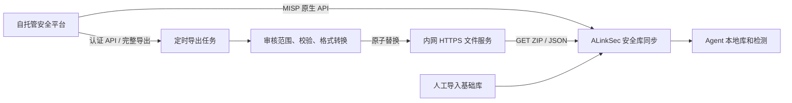

# 开源安全平台对接指南

本文对应 `alinksec-add` 分支新增的安全库同步功能。先部署包含该功能的服务端、前端并完成数据库迁移；旧版 `v0.0.2` 镜像不会因增加配置文件而获得同步能力。基础格式、容量和对象存储见 [安全库同步与存储](15-安全库同步与存储.md)。下列上游接口依据官方文档于 2026-10-03 核对，实际部署应同时检查所用平台版本。

## 1. 平台选择与当前支持范围

建议先接 **MISP 的恶意文件 SHA256 情报**。已有 OpenCTI 时可以沿用其情报治理；漏洞聚合可采用 **Vulnerability-Lookup**。这些平台管理情报，实际检测仍由 Agent 的哈希与内部规则引擎完成。

| 平台/数据服务 | 属性与用途 | 当前接入方式 | 边界 |
|---|---|---|---|
| [MISP](https://www.misp-project.org/documentation/) | 开源、可自托管；事件、恶意文件指标和情报审核 | 原生 `misp`；也可使用外置导出脚本 → `signature-zip` | 原生同步已实现，需只读密钥和明确审核标签 |
| [OpenCTI Community](https://github.com/OpenCTI-Platform/opencti) | 开源社区版、可自托管；情报关联与指标生命周期 | GraphQL/官方 Python 客户端导出 → 筛选、转换 → `signature-zip` | 本文提供请求与转换约定；自动分页、过滤导出任务需部署方实现 |
| [Vulnerability-Lookup](https://www.vulnerability-lookup.org/about/) | 开源、可自托管；聚合多来源漏洞公告 | REST 获取记录 → 转换为规范 JSON → `cve-json` | 本文提供字段映射；发行版公告适配器尚未实现 |
| [NVD](https://nvd.nist.gov/developers/vulnerabilities) | 公共漏洞数据服务，非自托管开源平台 | 原生 `nvd` 适配器 | 默认仅漏洞信息，不生成猜测的补丁或发行版匹配规则 |
| [MalwareBazaar](https://bazaar.abuse.ch/api/) | 社区恶意样本情报服务，非自托管开源平台 | 原生 `malwarebazaar` 适配器 | 需要认证密钥；近期接口只覆盖 60 分钟，商业使用条件以提供方为准 |
| [ClamAV](https://docs.clamav.net/manual/Usage/SignatureManagement.html) | 开源杀毒引擎，使用自己的特征库 | 当前不支持直接接入其 `.cvd/.cld` | 要使用完整 ClamAV 库，需另行集成其引擎与 FreshClam 更新流程 |

目前没有原生 OpenCTI、TAXII、STIX、OVAL 或 WSUS 适配器。不能把这些平台的 API 地址直接填入 `hashes`/`cve-json` 后认为已经接通，也不能把 ClamAV 数据库、YARA 或 Sigma 文件改成 ZIP 后下发。基线接入路线见 [安全数据接入与演进](17-安全数据接入与演进.md)。

## 2. 通用桥接架构和认证



导出任务可以运行在已有情报服务或独立桥接机。它持有上游只读凭据，负责完整分页和情报筛选。ALinkSec 只读取转换后的文件；远端故障时沿用已发布库和人工基础库。

| ALinkSec 类型 | 传输与认证 | 文件语义 |
|---|---|---|
| `hashes` | HTTPS GET；不支持认证头 | 文本，每行 `sha256 [name [severity]]`；累积更新，不撤销旧哈希 |
| `signature-zip` | HTTPS GET；不支持认证头 | 完整 ZIP 快照；只替换该源，支持 ETag/Last-Modified |
| `cve-json` | HTTPS GET；不支持认证头 | 非空规范 JSON 数组；按 CVE 更新，不自动删除消失的记录 |
| `misp` | POST JSON；`api-key` 转为原始 `Authorization` | 审核标签范围内的完整 SHA256 快照 |
| `nvd` | 官方 API；可配置 NVD `api-key` | 按修改窗口分页 |
| `malwarebazaar` | 官方 API POST；`api-key` 转为 `Auth-Key` | 近期哈希与家族名 |

**通用源中的 `api-key` 不会生成 Authorization 头。** 文件服务应通过内网访问范围、来源地址等控制读取；若必须使用 Bearer、Basic Auth 或 mTLS，需要扩展下载适配器，不能把令牌塞进 URL。使用桥接方案时，上游平台密钥保存在桥接机的权限受控文件中；原生适配器的密钥保存在 ALinkSec 部署配置中。

正式源必须使用 HTTPS，证书链须被服务端 JVM 信任；私有 CA 应导入实际运行服务的信任库。禁止跟随重定向，因此配置最终文件地址。容器内 `127.0.0.1` 指向容器自身；测试时允许回环 HTTP，正式部署使用可达的内网域名。

## 3. MISP：原生同步与备用桥接

### 3.0 原生同步（推荐）

服务端现在可以直接请求 MISP，无需运行外置导出任务。先在实例中建立已审核的 `alinksec:malicious-file` 标签和只读 Auth Key，再在 `libraries.yml` 加入：

```yaml
alinksec:
  libraries:
    sources:
      - id: misp
        type: misp
        enabled: false
        url: https://misp.internal.example/attributes/restSearch
        api-key: ${ALINKSEC_MISP_KEY:}
        misp-tag: alinksec:malicious-file
        interval-ms: 1800000
```

把密钥传入实际服务进程/容器环境，或写入权限受控的配置文件。环境变量传递注意事项见第 6 节。配置加载后，管理员在“安全库管理 → 同步计划”启用来源、保存并执行首次同步。控制台不会返回地址、标签或密钥；缺少必要配置时会提示补齐。

适配器发送 `returnFormat=text`、`type=sha256`、`published=true`、`to_ids=true`、`deleted=false`、`enforceWarninglist=true` 和审核标签；不指定 `last`、`page` 或 `limit`，使用 MISP 完整导出。响应必须为非空有效哈希列表，受 64 MiB/25 万条上限约束，统一检出名为 `MISP.KnownHash`、严重程度 4。验证完成后才替换该源；内容不变不重复发布，格式错误、超限或下载中断保留旧库。各实例应核对是否有导出截断设置；超大集合应缩小审核范围或采用下面的桥接方案。

建议每 30 分钟检查。该方式会撤销非空新快照中消失的本源哈希；清空所有记录的边界见第 3.5 节。MISP 自身的情报审核和来源更新仍需运营，平台不会将全部可观测哈希自动视为恶意。

第 3.1～3.4 节保留外置桥接，用于隔离网络、集中导出或离线导入。对于同一集合，选择 `misp` 或 `misp-export` 其中一种，避免另一来源继续保留已撤销的哈希。

### 3.1 建立导出范围

在 MISP 创建用于同步的只读账号和 Auth Key，账号只能读取允许下发的事件。MISP 请求使用原始 `Authorization: <key>`，没有 `Bearer` 前缀。端点与过滤参数依据 [MISP 2.5 官方 API 规范](https://raw.githubusercontent.com/MISP/MISP/2.5/app/webroot/doc/openapi.yaml)。

由分析人员给确定为恶意文件的事件或属性打上自定义标签 `alinksec:malicious-file`。这是本示例约定的标签，需要在你的实例中创建、审核并使用；不是 MISP 自动提供的恶意判定。仅有 `sha256` 属性不代表文件恶意，不应导出全部可观测文件。

[misp-query.example.json](../deploy/libraries/misp-query.example.json) 只选取已发布、`to_ids` 开启、未删除、符合标签且通过 warninglist 筛选的 `sha256` 属性，输出每行一个哈希。它不处理 `filename|sha256`、MD5、IP、域名或 URL。不同实例的标签、衰减策略和共享标记应在导出前确认。

### 3.2 准备桥接文件

桥接机需要 Bash、curl、Python **3.8 或以上** 和 `flock`，打包工具仅使用 Python 标准库。以下命令均为部署示例，路径可以按自己的环境调整；以仓库根目录为起点。

```sh
install -d -m 700 /etc/alinksec-feed
install -m 600 deploy/libraries/misp.curl.example.conf /etc/alinksec-feed/misp.curl.conf
install -m 600 deploy/libraries/misp-query.example.json /etc/alinksec-feed/misp-query.json
install -d -m 750 /srv/alinksec-feed/misp
```

编辑 `/etc/alinksec-feed/misp.curl.conf`，替换实例地址和密钥；使用内部 CA 时设置 `cacert`。不要启用 `insecure`、`location`，不要提交真实密钥到仓库。

```ini
url = "https://misp.internal.example/attributes/restSearch"
header = "Authorization: 在此填入只读密钥"
header = "Content-Type: application/json"
header = "Accept: application/json"
```

运行完整导出与打包：

```sh
bash deploy/libraries/refresh-misp.sh \
  /etc/alinksec-feed/misp.curl.conf \
  /etc/alinksec-feed/misp-query.json \
  /srv/alinksec-feed/misp/signatures.zip
```

成功时输出包版本、有效哈希数、ZIP SHA256 与 `changed`。脚本限制下载大小和时长，避免并发刷新；无效、空或超限响应不会替换旧包。重复哈希归一化并去重，相同内容不改写文件。包内只有 `manifest.json` 和 `hashes.txt`，严重程度默认 4、名称为 `MISP.KnownHash`；该严重程度是本地约定，不是 MISP 分数的自动换算。

如已经取得完整纯哈希文件，可单独调用 [build-signature-package.py](../deploy/libraries/build-signature-package.py)：

```sh
python3 deploy/libraries/build-signature-package.py \
  --input /srv/alinksec-feed/approved-sha256.txt \
  --output /srv/alinksec-feed/misp/signatures.zip \
  --name MISP.KnownHash --severity 4 --max-hashes 100000
```

默认最多 25 万条、输入及包解压后不超过 64 MiB。合并后的人工库与其他源也占用平台 25 万条限额；可降低 `--max-hashes` 给其他源留容量。工具拒绝在输入路径上覆盖输出。

本示例不设置 `last`、`timestamp`、`limit` 或 `page`，意图导出标签范围内的**全部当前有效哈希**。先在 MISP 查询界面确认完整命中数与导出数量。若实例设置了结果上限或数据量太大，应缩小审核范围，或编写完整分页任务；每一页成功、核对总数后才允许发布。禁止把第一页或最近修改的增量当成完整快照，否则会撤销其余历史情报。[MISP API 培训材料](https://www.misp-project.org/misp-training/handout/a.7-rest-API_handout.pdf) 说明了过滤与分页方式。

### 3.3 发布到内网 HTTPS

让已有 HTTPS 文件服务读取 `/srv/alinksec-feed/misp/signatures.zip`。新包权限为 `0640`，更新时保留原文件权限；把目录设为发布账号与 Web 服务共用的组并启用 setgid，使原子替换的新文件继承该组。上游配置文件、临时导出、锁文件不对外提供。

已有 Nginx TLS 站点可加入以下精确路径示例，替换地址范围：

```nginx
location = /feeds/misp/signatures.zip {
    alias /srv/alinksec-feed/misp/signatures.zip;
    default_type application/zip;
    etag on;
    allow 10.20.30.40;  # ALinkSec 实际出口地址
    deny all;
}
```

证书、网络策略按已有站点配置。服务端可访问的最终 URL 例如 `https://feeds.internal.example/feeds/misp/signatures.zip`，不能要求登录或重定向。先确认 GET 返回实际 ZIP；文件服务可返回 ETag/Last-Modified，避免每次下载相同内容。

导出任务建议每 30 分钟，ALinkSec 每 30 分钟检查。Cron 示例中脚本路径必须为桥接机的实际仓库路径：

```cron
*/30 * * * * /bin/bash /opt/alinksec/deploy/libraries/refresh-misp.sh /etc/alinksec-feed/misp.curl.conf /etc/alinksec-feed/misp-query.json /srv/alinksec-feed/misp/signatures.zip >>/var/log/alinksec-feed.log 2>&1
```

需要监控**桥接导出任务的失败和最后成功时间**。桥接任务失败时，文件服务仍会提供旧 ZIP；ALinkSec 检查成功或返回 304，并不能证明上游 MISP 情报刚更新。

### 3.4 配置 ALinkSec

在实际 `libraries.yml` 的 `sources` 列表中加入：

```yaml
alinksec:
  libraries:
    sources:
      - id: misp-export
        type: signature-zip
        enabled: true
        url: https://feeds.internal.example/feeds/misp/signatures.zip
        interval-ms: 1800000
```

将条目合并到已有配置，不能重复定义同一个 YAML 键；源 ID 应稳定且唯一。源列表总数最多 16 个；新增配置需要重启新版服务。

轻量 Compose 部署示例，在仓库根目录运行（已存在 `.env.lite` 和新版服务）：

```sh
chmod 600 libraries.yml
docker compose --env-file deploy/docker/.env.lite \
  -f deploy/docker/docker-compose.lite.yml \
  cp libraries.yml server:/app/data/libraries.yml
docker compose --env-file deploy/docker/.env.lite \
  -f deploy/docker/docker-compose.lite.yml restart server
```

标准模式使用对应 Compose 文件与 `.env`；原生模式把配置放到工作目录的 `data/libraries.yml`，或设置 `ALINKSEC_LIBRARY_CONFIG`。确保配置对实际服务账号可读。

管理员进入“安全库管理”点击 `misp-export` 的同步，确认成功状态、源条目数和已发布版本；随后检查 Agent 特征更新任务及本地版本。也可通过管理员会话调用 `POST /api/libraries/sources/misp-export/sync`，`GET /api/libraries` 查看结果。

### 3.5 撤销与空库

下一次**非空完整快照**中消失的哈希，会从 `misp-export` 源移除；其他源仍可能包含它，人工条目对重复项优先。`hashes` 类型是累积模式，不适合这种撤销需求。

当前拒绝空库，禁用源也不会删除历史数据。所以撤销最后一条哈希、彻底退役某来源需要额外的数据管理流程，不能通过空文件或 `enabled: false` 完成。确认误报时可先使用既有病毒白名单管理，并核对所有来源；完整的来源清空接口尚未实现。

## 4. OpenCTI：GraphQL 导出与转换约定

适合已有 OpenCTI 实例的环境。使用只读账号，其可访问数据范围决定导出范围；用户资料页可获得 API Token。官方接口是 `POST https://<实例>/graphql`，认证为 `Authorization: Bearer <token>`；实例的 `/public/graphql` 可查看当前 Schema。[官方集成文档](https://docs.opencti.io/latest/deployment/integrations/) 与 [GraphQL 文档](https://docs.opencti.io/latest/reference/api/) 说明接口和认证。

在导出任务中使用 [官方 Python 客户端](https://github.com/OpenCTI-Platform/client-python) 或 HTTP 客户端，按实例版本固定依赖与查询。以下查询用于理解所需字段，已与 [上游 Indicator Schema](https://raw.githubusercontent.com/OpenCTI-Platform/opencti/master/opencti-platform/opencti-graphql/src/modules/indicator/indicator.graphql) 核对；先在自己实例的 Playground 验证：

```graphql
query AlinksecHashes($after: ID) {
  indicators(first: 200, after: $after) {
    pageInfo { hasNextPage endCursor }
    edges {
      node {
        id pattern_type pattern revoked confidence
        valid_from valid_until x_opencti_detection
        objectLabel { value }
      }
    }
  }
}
```

POST 请求体为 `{"query":"上述查询文本","variables":{"after":null}}`。第一次 `after=null`，之后取上一页 `endCursor`，直到 `hasNextPage=false`。检查每页 HTTP 状态、GraphQL `errors` 和 `data`；任意一页失败不发布。查询没有指定业务过滤器，生产任务应使用当前实例支持的 `FilterGroup` 或在桥接端严格过滤，并保证账号/查询只覆盖允许导出的范围。

转换任务必须执行以下约定：

1. 仅接受审核标签（例如自定义 `alinksec:malicious-file`）范围内的有效 Indicator，排除 `revoked=true`、检测关闭、尚未生效、已经过期的记录；缺失必要字段时不要猜测。
2. 置信度阈值由自己的审核策略确定，例如 `confidence >= 75`。置信度不能直接当作 ALinkSec 严重程度。
3. 只处理 `pattern_type=stix` 的**单一、完整 SHA256 等值模式**，例如 `[file:hashes.'SHA-256' = '64位十六进制哈希']`。不要用搜索正则从任意模式里捞出一个哈希；包含 AND/OR、NOT、时间限定或其他条件的模式应交给完整 STIX 解释器或拒绝转换。
4. 完整分页完成后输出每行一个有效 SHA256，调用第 3 节打包工具，使用 `--name OpenCTI.KnownHash`，发布独立 `opencti-export` 的 `signature-zip` 源。

OpenCTI 自身会管理指标有效期和撤销，详见 [官方生命周期说明](https://docs.opencti.io/latest/usage/indicators-lifecycle/)。桥接应按完整有效集合生成快照，而不是把近期更新页直接替换全库。本文没有提供完成自动分页与 STIX 过滤的原生 OpenCTI 连接器；在导出任务实现前，该配置不能直接投入自动同步。

CSV、TAXII 2.1 和实时流也是 OpenCTI 的上游导出方式，但当前 ALinkSec 没有相应解析器，仍需桥接转换。导出后的 HTTPS 发布、调度、容量、凭据隔离和撤销边界与 MISP 相同。

## 5. Vulnerability-Lookup：漏洞信息与匹配规则

[Vulnerability-Lookup](https://github.com/vulnerability-lookup/vulnerability-lookup) 可自托管并聚合不同来源公告；也可使用 CIRCL 公共实例。其 [官方 REST API](https://www.vulnerability-lookup.org/documentation/api.html) 位于 `/api`，例如：

```sh
curl --fail --silent --show-error --connect-timeout 10 --max-time 30 \
  'https://vulnerability.circl.lu/api/vulnerability/CVE-2024-38063' \
  --output cve-record.json
```

批量导出按实例 OpenAPI 选择来源与日期窗口、完整分页；不能只请求最近十几条就视为全历史初始化。认证要求按实例配置处理。该接口返回的 CVE 原始对象/多源结构**不等于** ALinkSec 的规范数组，需实现来源格式转换：

| 原始信息 | ALinkSec 字段 | 转换要求 |
|---|---|---|
| CVE 5 `cveMetadata.cveId` 或其他来源的 CVE 标识 | `cve_id` | 仅导入合法 `CVE-YYYY-NNNN...`；其他公告 ID 先做可信 CVE 关联 |
| 公告标题或描述 | `title` | 选择明确来源和语言；没有标题时使用经过整理的描述 |
| 指定来源的 CVSS 基础分 | `cvss`、`severity` | `cvss` 为 0～10；本地约定 `<4 → 1`、`4～<7 → 2`、`7～<9 → 3`、`≥9 → 4`；缺分记录先补充审核，不自动填成高危 |
| 产品、版本、系统适用条件 | `affected` | 无可靠包映射时填 `[]`，只作为信息库；不能照抄整个上游结构 |
| 厂商确认的修复版本 | `affected[].fixed_version` | 只有确认目标系统、软件包来源和版本后才填写 |

转换后是**数组**，例如仅同步信息的最小结构：

```json
[
  {
    "cve_id": "CVE-2026-12345",
    "title": "示例公告：请替换为真实来源内容",
    "severity": 3,
    "cvss": 7.5,
    "affected": []
  }
]
```

将经过审核的非空 JSON 数组原子发布到 HTTPS 文件服务，添加源：

```yaml
- id: vulnerability-lookup-export
  type: cve-json
  enabled: true
  url: https://feeds.internal.example/feeds/vulnerabilities.json
  interval-ms: 7200000
```

建议桥接与平台每两小时处理更新，成功完成所有页后再保存上游进度；重试保留小范围重叠。首次历史导入按批次组织，每次最多 1 万条、64 MiB。`cve-json` 是更新合并语义，单批不需要包含全历史，但不会自动删除撤销公告；需要明确的人工修订/退役流程。

若要产生资产漏洞结果，另外维护 [规范 `affected` 规则](15-安全库同步与存储.md#漏洞导入和比对)，使用 Agent 实际上报的软件包名、系统版本和来源，以及厂商确认的版本范围。当前通用版本比较不实现完整 RPM/DPKG、OVAL 与发行版回移语义；仅同步公告不能宣称已实现发行版准确补丁判定。

## 6. 已有原生数据服务的配置

如果暂时没有自托管情报平台，可启用 [libraries.example.yml](../deploy/libraries.example.yml) 中原生源：

```yaml
alinksec:
  libraries:
    sources:
      - id: malwarebazaar
        type: malwarebazaar
        enabled: true
        interval-ms: 1800000
        api-key: ${ALINKSEC_MALWAREBAZAAR_KEY:}
      - id: nvd
        type: nvd
        enabled: true
        interval-ms: 7200000
        initial-days: 7
        api-key: ${ALINKSEC_NVD_KEY:}
```

MalwareBazaar 密钥从其官方认证入口申请；只同步近期哈希，不下载样本。NVD API Key 可从 [官方开发者入口](https://nvd.nist.gov/developers/start-here) 申请，没有 Key 也可按适配器限速访问。NVD 默认 7 天修改窗口，后续保存游标；需要全历史信息时另行分批初始化。MalwareBazaar 间断超过 60 分钟需补库，不能靠恢复近期请求补回遗漏。

上述 `${...}` 必须在**实际服务进程/容器环境**中存在，或改为权限受控配置文件里的密钥值。仓库现有 Compose 不自动把任意 `.env` 键传入容器；只往 `.env.lite` 写这些变量还不够。若选环境变量方式，增加 Compose override：

```yaml
services:
  server:
    environment:
      ALINKSEC_MALWAREBAZAAR_KEY: ${ALINKSEC_MALWAREBAZAAR_KEY:?set provider key}
      ALINKSEC_NVD_KEY: ${ALINKSEC_NVD_KEY:-}
```

使用该 override 和受保护的环境文件重新创建 `server` 服务（`up -d --no-deps server`）；仅 `restart` 不会更新容器环境。只启用 NVD 时删除不需要的 MalwareBazaar 环境项。原生 MISP 同理，在 override 的 `environment` 中添加 `ALINKSEC_MISP_KEY: ${ALINKSEC_MISP_KEY:?set MISP key}`。密钥不由控制台接口返回。

## 7. 补丁文件、存储和验收

MISP/OpenCTI 提供文件指标，Vulnerability-Lookup/NVD 提供漏洞信息；这些数据不直接提供目标系统可安装的补丁包。目前补丁二进制仍走人工上传与已有修复流程，未实现自动发行版镜像、WSUS 或这些平台的补丁下载。未来接发行版公告时还需可靠包版本比较、仓库签名校验、适用性与修复包选择。

桥接 ZIP 和 JSON 起步可放持久化磁盘，发布目录避免放进容器临时层。已有 S3 兼容服务时可用于平台的病毒包、补丁文件存储；通用源目前不能读 `s3://` 或签名请求，可使用受控 HTTPS 文件端点，不能填需要动态签名的私有桶地址。数据库保存索引与进度，Agent 的内存索引容量仍受限。

上线前使用自己的测试平台核对：完整导出数量、首次同步、相同内容不重复发布、非空快照撤销、上游认证失败/空响应保留旧库、人工与远端合并、Agent 安装和受控扫描结果。哈希情报只检测库中完全相同的文件；不等于具备完整通用杀毒引擎的变种检测能力。

仓库验证命令：

```sh
python3 -B -m unittest discover -s deploy/tests -p 'test_library_feed_tools.py' -v
bash -n deploy/libraries/refresh-misp.sh
```

工具测试使用本地导出文件和模拟 curl，覆盖格式、去重、容量拒绝、失败保留、完整 ZIP 与刷新流程；没有使用部署方的 MISP/OpenCTI 凭据完成生产实例联调。真实平台联调需要实际地址、只读凭据和已审核的导出范围。
